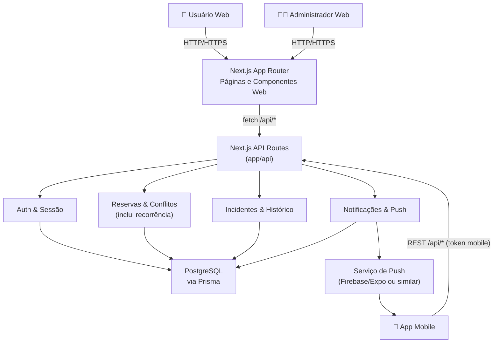

# Arquitetura da Aplicação SALA Web

## Visão Geral da Arquitetura

A aplicação **SALA Web** é construída sobre **Next.js (App Router)** com **TypeScript** e integra:

- **Frontend web**: Páginas React em `web/src/app/[locale]/...`, componentes de layout e UI reutilizáveis.
- **Backend HTTP**: Route Handlers em `web/src/app/api/...` expondo APIs RESTful para reservas, salas, usuários, notificações e incidentes.
- **Camada de domínio**: Serviços e utilitários em `web/src/lib/...` (autenticação, reservas recorrentes, notificações, incidentes).
- **Persistência**: Banco PostgreSQL acessado via **Prisma**, com entidades como `User`, `Room`, `Reservation`, `Incident`, `Notification`, `PushToken`.
- **Integração mobile**: Autenticação híbrida e notificações push consumidas pelo app mobile.

Para a visão de negócio e posicionamento estratégico do produto, consultar também o documento de canvas: `docs/Canvas-Negocio-SALA.md`.

## Diagrama de Arquitetura (alto nível)

## Camadas e Módulos

### Frontend Web (Next.js App Router)

- **Páginas por domínio** em `src/app/[locale]/...`:
  - Agendamentos, detalhes de sala, itens, aprovações, solicitações.
  - Perfil, usuários, notificações, incidentes, dashboard.
- **Componentes de layout**:
  - `PageLayout`, `Sidebar`, `Header`, páginas de loading/erro.
- **Componentes de UI**:
  - Botões, modais, calendários, badges de status, toasts, tabelas.
- **Internacionalização**:
  - `next-intl` com dicionários por idioma.

### Backend HTTP (API Routes)

Localizado em `src/app/api/...`, organizado por domínio:

- **Reservas**: `/api/reservations`, `/api/reservations/[id]`, `/api/reservations/approve`, `/api/reservations/check-conflict`, `/api/reservations/user/[userId]/stats`.
- **Salas e Itens**: `/api/rooms`, `/api/rooms/[id]`, `/api/rooms/[id]/status`, `/api/items`.
- **Usuários e Autenticação**: `/api/users`, `/api/users/[userId]`, `/api/auth/*`, endpoints de token mobile.
- **Notificações e Push**: `/api/notifications`, `/api/notifications/count`, `/api/notifications/mark-all-read`, `/api/push-tokens`, endpoints de teste/debug.
- **Incidentes**: `/api/incidents`, `/api/incidents/[id]`, `/api/incidents/stats`, `/api/incidents/assignable-users`.

Cada rota:

- Valida entrada (principalmente com Zod).
- Verifica autenticação/autorização (NextAuth / auth híbrida).
- Orquestra chamadas à camada de domínio (`lib/...`) e ao Prisma.
- Retorna respostas JSON via `NextResponse`.

### Camada de Domínio (`lib/`)

Principais módulos:

- **Autenticação**:
  - Gestão de sessão web (NextAuth) e tokens móveis.
  - Verificação de permissões (ADMIN/USER) nas APIs.
- **Reservas e Recorrência**:
  - Geração de datas recorrentes (`DAILY`, `WEEKLY`, `MONTHLY`).
  - Criação em lote de reservas recorrentes vinculadas a um template.
  - Verificação de conflitos considerando reservas ativas, aprovadas e pendentes.
  - Aprovação/rejeição (inclusive em lote para conjuntos recorrentes).
- **Notificações**:
  - Criação de notificações de negócio para eventos de reserva e incidente.
  - Integração com push notification (via `PushToken`).
  - Contadores e filtros de notificações lidas/não lidas.
- **Incidentes**:
  - Criação, atribuição e atualização de status.
  - Registro de histórico em `IncidentStatusHistory`.
  - Cálculo de estatísticas (por status, prioridade, categoria, sala/item, tempos médios).

### Persistência (Prisma + PostgreSQL)

- Modelos principais:
  - `User`, `Room`, `Item`, `Image`, `Reservation`, `Notification`, `Incident`, `IncidentStatusHistory`, `PushToken`.
- Enums:
  - `Role`, `RoomStatus`, `ReservationStatus`, `NotificationType`, `IncidentStatus`, `IncidentPriority`, `IncidentCategory`, `RecurringPattern`.
- Relacionamentos:
  - Usuários com reservas, notificações, tokens de push e incidentes reportados/atribuídos.
  - Salas com reservas, itens e incidentes.
  - Reservas com informações de recorrência e vínculo pai/filhas.

## Fluxos Principais

### Fluxo de Reserva de Sala

1. Usuário acessa a página de agendamentos ou detalhes de sala.
2. Frontend carrega salas, reservas e, quando disponível, usuários (para seleção).
3. Usuário preenche o formulário de reserva (simples ou recorrente).
4. Frontend envia `POST /api/reservations` com os dados normalizados.
5. Backend:
   - Valida payload e usuário/sala.
   - Verifica conflitos de horário (considerando estados relevantes).
   - Cria reserva única ou conjunto recorrente.
   - Registra notificações apropriadas.
6. Usuário é informado do sucesso/erro e a listagem de reservas é atualizada.

### Fluxo de Aprovação/Rejeição de Reservas

1. Administrador acessa telas de aprovações/solicitações.
2. Seleciona uma reserva (simples ou parte de uma recorrência).
3. Frontend envia `POST /api/reservations/approve` (ou `/[id]/approve`/`/[id]/reject`).
4. Backend:
   - Verifica permissões de ADMIN.
   - Atualiza status da reserva (ou de todas as instâncias do template recorrente).
   - Cria notificações para o usuário solicitante e dispara push.

### Fluxo de Incidentes

1. Usuário reporta incidente a partir de uma sala ou item.
2. Frontend envia `POST /api/incidents` com título, descrição, categoria, prioridade e referência (sala/item).
3. Backend:
   - Cria o incidente com status inicial `REPORTED`.
   - Registra primeiro histórico em `IncidentStatusHistory`.
   - Notifica administradores.
4. Administradores utilizam telas de gestão para:
   - Atribuir responsáveis.
   - Alterar status (ex.: `IN_ANALYSIS`, `IN_PROGRESS`, `RESOLVED`, `CANCELLED`).
   - Registrar notas e tempos de resolução.
5. Dados consolidados alimentam o dashboard via `/api/incidents/stats`.

### Fluxo de Notificações e Push

1. Eventos de negócio (criação/aprovação/cancelamento de reservas, incidentes) disparam chamadas a `NotificationService`.
2. `NotificationService`:
   - Cria registros em `Notification` para os usuários-alvo.
   - Consulta `PushToken` e, quando disponível, envia push via serviço de push.
3. Usuário web:
   - Vê notificações no centro de notificações.
   - Usa rotas como `/api/notifications/count` e `/api/notifications/mark-all-read`.
4. App mobile:
   - Recebe notificações push e consome as mesmas APIs para sincronizar estado.
