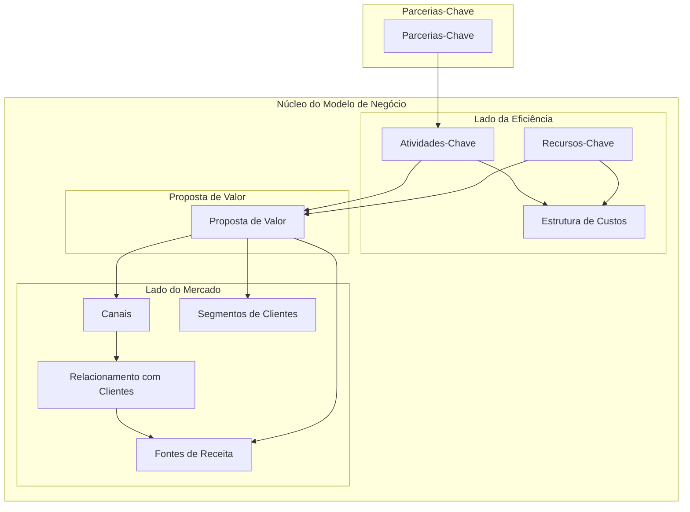

# Business Model Canvas - Projeto **S.A.L.A.**

Sistema de Agendamento de Laboratórios

O Business Model Canvas abaixo descreve a estrutura estratégica para o projeto **S.A.L.A.**, focando na resolução do problema de gestão de espaços físicos em instituições de ensino e ambientes corporativos.

## Visão Geral (Diagrama)

## 1. Segmentos de Clientes

- **Instituições de Ensino**

  - Universidades (como o UniDomBosco), faculdades e escolas técnicas que possuem múltiplos laboratórios e salas de uso comum.

- **Empresas com Ambientes Compartilhados**

  - Escritórios de médio e grande porte que precisam gerenciar salas de reunião, salas de videoconferência ou laboratórios internos de PD&I.

- **Espaços de Coworking**

  - Hubs de inovação que alugam salas por hora ou período para diferentes clientes.

- **Corpo Docente e Colaboradores**
  - Usuários finais que necessitam de previsibilidade e agilidade para reservar espaços de trabalho.

## 2. Proposta de Valor

- **Fim dos Conflitos de Agenda**

  - Eliminação de reservas duplicadas através de validação sistêmica em tempo real.

- **Transparência e Autonomia**

  - Visualização instantânea da disponibilidade de salas sem necessidade de intermediários manuais.

- **Otimização de Recursos**

  - Melhor aproveitamento dos espaços físicos, identificando salas ociosas e reduzindo custos com infraestrutura subutilizada.

- **Profissionalismo e Agilidade**
  - Redução de atrasos em reuniões ou aulas devido à falta de local adequado.

## 3. Canais

- **Plataforma Web/Mobile**

  - Interface principal onde as reservas e consultas são realizadas.

- **Notificações Digitais**

  - Alertas via e-mail ou push informando sobre confirmações ou alterações de agendamento.

- **Integrações**
  - Possibilidade de integração com calendários corporativos (Google Calendar, Outlook).

## 4. Relacionamento com Clientes

- **Self-Service (Autoatendimento)**

  - O usuário tem autonomia para realizar suas próprias reservas dentro das regras do sistema.

- **Suporte Técnico Dedicado**

  - Assistência para os administradores (TI ou RH) na configuração de novas salas e perfis.

- **Fidelização**
  - Melhoria contínua do software baseada em métricas de uso e feedbacks dos usuários.

## 5. Fontes de Receita

- **Modelo SaaS (Software as a Service)**

  - Assinatura mensal baseada no número de salas/recursos cadastrados ou no número de usuários.

- **Licenciamento Corporativo**

  - Valor fixo para uso ilimitado dentro de uma única organização.

- **Serviços de Customização**
  - Adaptação da interface com a identidade visual da empresa (White Label).

## 6. Recursos-Chave

- **Equipe de Desenvolvimento**

  - Especialistas em desenvolvimento Full Stack e UI/UX.

- **Infraestrutura de Nuvem**

  - Servidores escaláveis para suportar múltiplos clientes simultaneamente.

- **Algoritmo de Agendamento**
  - Lógica proprietária para prevenção de conflitos e gestão de fusos horários/regras complexas.

## 7. Atividades-Chave

- **Desenvolvimento e Manutenção**

  - Atualizações de segurança e implementação de novas funcionalidades.

- **Vendas e Marketing**

  - Estratégias para captação de clientes B2B (empresas e escolas).

- **Gestão de Infraestrutura**
  - Garantir disponibilidade e performance do sistema.

## 8. Parcerias-Chave

- **Instituições de Ensino Piloto**

  - Para validação acadêmica do sistema.

- **Consultorias de RH/Facilities**

  - Podem indicar o software para empresas que estão reestruturando seus espaços físicos.

- **Marketplaces de Aplicativos**
  - Plataformas de distribuição para facilitar a instalação em ambientes corporativos.

## 9. Estrutura de Custos

- **Hospedagem e Cloud**

  - Custos variáveis de acordo com o tráfego e armazenamento de dados.

- **Marketing e Aquisição de Clientes (CAC)**

  - Gastos com anúncios e prospecção de vendas.

- **Operação e Suporte**
  - Custo de manter uma equipe para atendimento e resolução de problemas técnicos.
