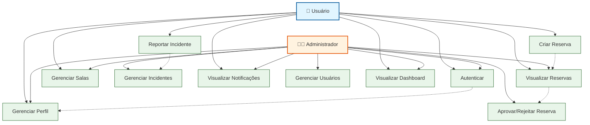

# Diagrama de Casos de Uso - Sistema SALA Web

## Descrição dos Casos de Uso

### 🔐 Autenticação

- **UC1 - Autenticar**: Login/Logout com Google OAuth

### 👤 Perfil

- **UC2 - Gerenciar Perfil**: Visualizar e editar informações do perfil

### 📅 Reservas

- **UC3 - Criar Reserva**: Criar solicitação de reserva (simples ou recorrente)
- **UC4 - Visualizar Reservas**: Listar e visualizar reservas
- **UC5 - Aprovar/Rejeitar Reserva**: Administrador aprova ou rejeita solicitações

### 🏢 Salas

- **UC6 - Gerenciar Salas**: Visualizar salas e gerenciar itens (Admin)

### ⚠️ Incidentes

- **UC7 - Reportar Incidente**: Usuário reporta um problema
- **UC8 - Gerenciar Incidentes**: Administrador atribui, atualiza e resolve incidentes

### 🔔 Notificações

- **UC9 - Visualizar Notificações**: Ver e gerenciar notificações recebidas

### 👥 Usuários (Admin)

- **UC10 - Gerenciar Usuários**: Administrador visualiza e altera roles dos usuários

### 📊 Dashboard

- **UC11 - Visualizar Dashboard**: Ver resumo e estatísticas do sistema
