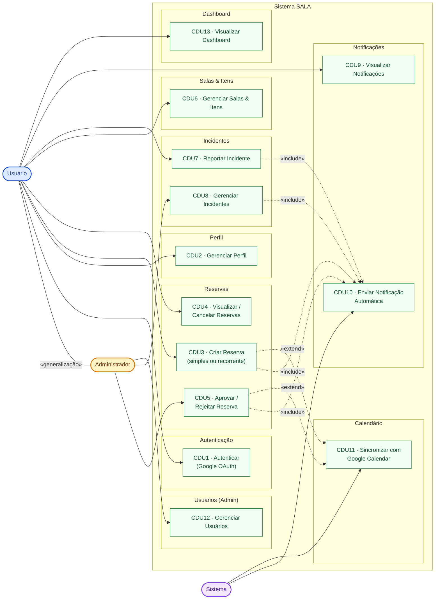

# Diagrama de Casos de Uso - Sistema SALA Web

```mermaid
graph LR
    %% -- Atores --
    User(["Usuário"])
    Admin(["Administrador"])
    Sistema(["Sistema"])

    %% Generalização: Admin é um Usuário
    User ---|"«generalização»"| Admin

    %% -- Casos de Uso --
    subgraph sistema_sala ["Sistema SALA"]

        subgraph auth ["Autenticação"]
            CDU1["CDU1 · Autenticar\n(Google OAuth)"]
        end

        subgraph perfil ["Perfil"]
            CDU2["CDU2 · Gerenciar Perfil"]
        end

        subgraph reservas ["Reservas"]
            CDU3["CDU3 · Criar Reserva\n(simples ou recorrente)"]
            CDU4["CDU4 · Visualizar /\nCancelar Reservas"]
            CDU5["CDU5 · Aprovar /\nRejeitar Reserva"]
        end

        subgraph salas ["Salas & Itens"]
            CDU6["CDU6 · Gerenciar Salas & Itens"]
        end

        subgraph incidentes ["Incidentes"]
            CDU7["CDU7 · Reportar Incidente"]
            CDU8["CDU8 · Gerenciar Incidentes"]
        end

        subgraph notificacoes ["Notificações"]
            CDU9["CDU9 · Visualizar Notificações"]
            CDU10["CDU10 · Enviar Notificação\nAutomática"]
        end

        subgraph calendario ["Calendário"]
            CDU11["CDU11 · Sincronizar com\nGoogle Calendar"]
        end

        subgraph usuarios_mgmt ["Usuários (Admin)"]
            CDU12["CDU12 · Gerenciar Usuários"]
        end

        subgraph dashboard ["Dashboard"]
            CDU13["CDU13 · Visualizar Dashboard"]
        end
    end

    %% -- Relacionamentos - Usuário --
    User --> CDU1
    User --> CDU2
    User --> CDU3
    User --> CDU4
    User --> CDU6
    User --> CDU7
    User --> CDU9
    User --> CDU13

    %% -- Relacionamentos - Administrador (exclusivos) --
    Admin --> CDU5
    Admin --> CDU8
    Admin --> CDU12

    %% -- Relacionamentos - Sistema --
    Sistema --> CDU10
    Sistema --> CDU11

    %% -- Dependências entre casos de uso --
    CDU3 -. "«include»" .-> CDU10
    CDU5 -. "«include»" .-> CDU10
    CDU7 -. "«include»" .-> CDU10
    CDU8 -. "«include»" .-> CDU10
    CDU3 -. "«extend»" .-> CDU11
    CDU5 -. "«extend»" .-> CDU11

    %% -- Estilos --
    classDef actorClass fill:#dbeafe,stroke:#1d4ed8,stroke-width:2px,color:#1e3a8a
    classDef adminClass fill:#fef3c7,stroke:#d97706,stroke-width:2px,color:#78350f
    classDef sistemaClass fill:#f3e8ff,stroke:#7c3aed,stroke-width:2px,color:#4c1d95
    classDef ucClass fill:#f0fdf4,stroke:#15803d,stroke-width:1px,color:#14532d

    class User actorClass
    class Admin adminClass
    class Sistema sistemaClass
    class CDU1,CDU2,CDU3,CDU4,CDU5,CDU6,CDU7,CDU8,CDU9,CDU10,CDU11,CDU12,CDU13 ucClass
```

## Atores

| Ator | Descricao |
|------|-----------|
| **Usuario** | Pessoa autenticada com role `USER`. Acessa reservas, salas, incidentes, notificacoes e dashboard. |
| **Administrador** | Usuario com role `ADMIN`. Herda todos os casos de uso do Usuario e possui permissoes exclusivas de gestao. |
| **Sistema** | Ator autonomo que executa acoes automaticamente em resposta a eventos de negocio, sem interacao direta humana. |

> **Nota de modelagem:** A relacao de **generalizacao** entre Usuario e Administrador expressa que o Admin possui todas as capacidades do Usuario mais as suas exclusivas, refletindo o campo `role` no modelo `User` do Prisma.

---

## Descricao dos Casos de Uso

---

### CDU1 - Autenticar

| Campo | Conteudo |
|-------|----------|
| **Descricao** | Permite que o usuario realize login e logout no sistema via Google OAuth 2.0. O aplicativo mobile utiliza um token JWT gerado pela API para autenticacao. |
| **Ator Principal** | Usuario (inclui Administrador) |
| **Pre-condicao** | O usuario possui uma conta Google valida. |
| **Pos-condicao** | Sessao autenticada criada (web via NextAuth) ou token JWT retornado (mobile). O usuario e redirecionado para a pagina inicial. |

**Fluxo Principal:**
1. Usuario acessa a pagina de login.
2. Clica em "Entrar com Google".
3. Sistema redireciona para autenticacao Google OAuth 2.0.
4. Google autentica o usuario e retorna a aplicacao.
5. Sistema verifica se a conta existe; se nao, cria automaticamente.
6. Sessao e iniciada e o usuario e redirecionado ao dashboard.

**Fluxo Alternativo:**
- **FA1 - Login mobile:** O mobile chama `POST /api/auth/mobile-token` com as credenciais Google; o sistema retorna um JWT com prazo de expiracao.
- **FA2 - Autenticacao falha:** Credenciais invalidas ou permissao negada no Google: sistema exibe mensagem de erro e retorna a tela de login.
- **FA3 - Logout:** Usuario clica em "Sair": sistema encerra a sessao e redireciona para a tela de login.

**Regras de Negocio:**
- `RN01` - A conta e criada automaticamente no primeiro login (provisionamento just-in-time).
- `RN02` - Role padrao ao criar conta e `USER`; somente um Administrador pode elevar para `ADMIN`.
- `RN03` - Tokens mobile expiram apos periodo configurado; renovacao requer novo login.

---

### CDU2 - Gerenciar Perfil

| Campo | Conteudo |
|-------|----------|
| **Descricao** | Permite que o usuario visualize e edite suas informacoes pessoais (nome e foto de perfil). |
| **Ator Principal** | Usuario (inclui Administrador) |
| **Pre-condicao** | Usuario autenticado (`CDU1` concluido). |
| **Pos-condicao** | Informacoes de perfil atualizadas e persistidas no banco de dados. |

**Fluxo Principal:**
1. Usuario acessa a pagina de perfil.
2. Sistema exibe nome, e-mail, foto, role e data de criacao da conta.
3. Usuario edita nome e/ou faz upload de nova foto.
4. Sistema valida os dados e persiste as alteracoes via `PATCH /api/users/[userId]`.
5. Confirmacao de sucesso e exibida.

**Fluxo Alternativo:**
- **FA1 - Dados invalidos:** Nome em branco ou arquivo de imagem invalido: sistema exibe mensagem de validacao sem salvar.
- **FA2 - Falha no upload de imagem:** Cloudinary indisponivel: sistema exibe erro e mantem foto anterior.

**Regras de Negocio:**
- `RN04` - O usuario so pode editar o proprio perfil; Administrador pode editar qualquer perfil.
- `RN05` - O campo e-mail e somente leitura (gerenciado pelo Google OAuth).
- `RN06` - Imagens de perfil sao armazenadas no Cloudinary e otimizadas automaticamente.

---

### CDU3 - Criar Reserva

| Campo | Conteudo |
|-------|----------|
| **Descricao** | Permite ao usuario criar uma solicitacao de reserva de sala, simples ou recorrente (`DAILY`, `WEEKLY`, `MONTHLY`), com verificacao automatica de conflitos de horario. |
| **Ator Principal** | Usuario (inclui Administrador) |
| **Pre-condicao** | Usuario autenticado. Existe ao menos uma sala com status `LIVRE` ou `RESERVADO`. |
| **Pos-condicao** | Reserva criada com status `PENDING` (Usuario) ou `APPROVED` (Administrador). Notificacao disparada (`CDU10`). Se Google Calendar vinculado, evento criado (`CDU11`). |

**Fluxo Principal:**
1. Usuario acessa a pagina de agendamentos ou detalhes de uma sala.
2. Preenche o formulario: sala, data, horario de inicio e fim, proposito (opcional).
3. (Opcional) Ativa recorrencia: seleciona padrao (`DAILY`, `WEEKLY`, `MONTHLY`), dias da semana e data de termino.
4. Sistema verifica conflitos via `POST /api/reservations/check-conflict`.
5. Sem conflito: sistema cria a reserva (ou conjunto de instancias recorrentes vinculadas ao template pai).
6. Sistema aciona `CDU10` (notificacao ao Administrador sobre nova solicitacao).
7. Se usuario tem Google Calendar vinculado, sistema aciona `CDU11`.
8. Usuario recebe confirmacao e listagem e atualizada.

**Fluxo Alternativo:**
- **FA1 - Conflito de horario:** Reserva sobreposta detectada: sistema retorna erro detalhado; usuario escolhe outro horario.
- **FA2 - Sala indisponivel:** Status da sala e `EM_USO`: sistema bloqueia a criacao.
- **FA3 - Administrador cria reserva:** Status inicial e `APPROVED` (sem necessidade de aprovacao) e notificacao nao e enviada ao administrador.
- **FA4 - Recorrencia parcialmente conflitante:** Algumas instancias conflitam: sistema cria apenas as nao conflitantes e informa quais foram ignoradas.

**Regras de Negocio:**
- `RN07` - Conflitos consideram reservas com status `ACTIVE`, `APPROVED` e `PENDING`.
- `RN08` - Para reservas `WEEKLY`, os dias da semana devem ser informados (campo `recurringDaysOfWeek`).
- `RN09` - Todas as instancias recorrentes sao vinculadas por `recurringTemplateId`.
- `RN10` - Reservas criadas por Administrador sao automaticamente aprovadas.

---

### CDU4 - Visualizar / Cancelar Reservas

| Campo | Conteudo |
|-------|----------|
| **Descricao** | Permite ao usuario listar, filtrar, visualizar detalhes e cancelar suas reservas. Administradores visualizam todas as reservas do sistema. |
| **Ator Principal** | Usuario (inclui Administrador) |
| **Pre-condicao** | Usuario autenticado. |
| **Pos-condicao** | Reserva cancelada com status `CANCELLED`. Notificacao disparada (`CDU10`). Evento no Google Calendar removido, se existente (`CDU11`). |

**Fluxo Principal:**
1. Usuario acessa a lista de reservas.
2. Sistema exibe reservas do usuario (Administrador ve todas), com filtros por status, data e sala.
3. Usuario seleciona uma reserva e visualiza os detalhes.
4. Usuario solicita cancelamento.
5. Sistema atualiza status para `CANCELLED` via `PATCH /api/reservations/[id]`.
6. Sistema aciona `CDU10` (notificacao de cancelamento).
7. Se havia evento no Google Calendar, `CDU11` remove o evento.

**Fluxo Alternativo:**
- **FA1 - Cancelamento de reserva recorrente:** Sistema oferece opcao de cancelar apenas a instancia selecionada ou toda a serie.
- **FA2 - Reserva ja cancelada ou rejeitada:** Opcao de cancelamento nao disponivel; status e apenas exibido.

**Regras de Negocio:**
- `RN11` - Usuario so pode cancelar suas proprias reservas; Administrador pode cancelar qualquer reserva.
- `RN12` - Reservas com status `COMPLETED` nao podem ser canceladas.
- `RN13` - Cancelamento de serie recorrente pode ser parcial (instancia unica) ou total (todas as instancias).

---

### CDU5 - Aprovar / Rejeitar Reserva *(exclusivo Administrador)*

| Campo | Conteudo |
|-------|----------|
| **Descricao** | Permite ao Administrador aprovar ou rejeitar solicitacoes de reserva pendentes, individualmente ou em lote para reservas recorrentes. |
| **Ator Principal** | Administrador |
| **Pre-condicao** | Usuario autenticado com role `ADMIN`. Existem reservas com status `PENDING`. |
| **Pos-condicao** | Reserva com status `APPROVED` ou `REJECTED`. Notificacao enviada ao solicitante (`CDU10`). Se aprovada e Google Calendar vinculado, evento criado ou atualizado (`CDU11`). |

**Fluxo Principal:**
1. Administrador acessa a tela de aprovacoes e solicitacoes.
2. Sistema lista reservas com status `PENDING`.
3. Administrador seleciona uma reserva e escolhe aprovar ou rejeitar.
4. Sistema atualiza o status via `POST /api/reservations/approve` (ou `/[id]/approve` / `/[id]/reject`).
5. Sistema aciona `CDU10` (notifica o solicitante sobre a decisao).
6. Se aprovada e usuario tem Google Calendar vinculado, aciona `CDU11`.

**Fluxo Alternativo:**
- **FA1 - Reserva recorrente:** Administrador pode aprovar ou rejeitar todas as instancias do template de uma vez.
- **FA2 - Conflito detectado na aprovacao:** Se outra reserva `APPROVED` colide no intervalo, sistema alerta o Administrador antes de confirmar.

**Regras de Negocio:**
- `RN14` - Apenas usuarios com role `ADMIN` podem executar este caso de uso.
- `RN15` - A aprovacao em lote afeta todas as instancias vinculadas ao mesmo `recurringTemplateId`.
- `RN16` - Rejeicao de reserva remove o evento do Google Calendar, se existente.

---

### CDU6 - Gerenciar Salas e Itens

| Campo | Conteudo |
|-------|----------|
| **Descricao** | Permite a visualizacao de salas a todos os usuarios. Administradores podem criar, editar, excluir salas e gerenciar os itens e equipamentos associados a cada sala. |
| **Ator Principal** | Usuario (visualizacao) / Administrador (gestao completa) |
| **Pre-condicao** | Usuario autenticado. |
| **Pos-condicao** | Sala ou item criado, atualizado ou excluido. Status da sala refletido para todos os usuarios. |

**Fluxo Principal (visualizacao - Usuario):**
1. Usuario acessa a lista de salas.
2. Sistema exibe salas com nome, descricao, capacidade, status e itens disponiveis.
3. Usuario filtra por status ou capacidade e visualiza detalhes.

**Fluxo Principal (gestao - Administrador):**
1. Administrador acessa a lista de salas.
2. Cria nova sala (nome, descricao, capacidade) via `POST /api/rooms`.
3. Edita informacoes ou altera status (`LIVRE`, `EM_USO`, `RESERVADO`) via `PATCH /api/rooms/[id]`.
4. Adiciona, edita ou remove itens da sala via `POST|PATCH|DELETE /api/items`.
5. Faz upload de imagens dos itens via `POST /api/uploads`.

**Fluxo Alternativo:**
- **FA1 - Exclusao com reservas ativas:** Sistema impede exclusao da sala se existirem reservas `ACTIVE` ou `APPROVED` associadas.
- **FA2 - Falha no upload de imagem:** Cloudinary indisponivel: sistema mantem imagem anterior e exibe mensagem de erro.

**Regras de Negocio:**
- `RN17` - Apenas Administrador pode criar, editar ou excluir salas e itens.
- `RN18` - Status da sala e atualizado independentemente do ciclo de reservas.
- `RN19` - Itens pertencem a uma sala; a exclusao da sala em cascata remove os itens associados.

---

### CDU7 - Reportar Incidente

| Campo | Conteudo |
|-------|----------|
| **Descricao** | Permite ao usuario reportar um problema ou ocorrencia relacionada a uma sala ou item, informando categoria e prioridade. |
| **Ator Principal** | Usuario (inclui Administrador) |
| **Pre-condicao** | Usuario autenticado. Existe ao menos uma sala ou item cadastrado no sistema. |
| **Pos-condicao** | Incidente criado com status `REPORTED`. Primeiro registro no historico (`IncidentStatusHistory`) criado. Administradores notificados (`CDU10`). |

**Fluxo Principal:**
1. Usuario acessa a pagina de incidentes ou o detalhe de uma sala ou item.
2. Preenche o formulario: titulo, descricao, categoria (`EQUIPMENT_FAILURE`, `INFRASTRUCTURE`, etc.), prioridade (`LOW`, `MEDIUM`, `HIGH`, `CRITICAL`) e referencia (sala ou item).
3. Sistema cria o incidente via `POST /api/incidents` com status `REPORTED`.
4. Sistema registra o primeiro historico em `IncidentStatusHistory`.
5. Sistema aciona `CDU10` para notificar os administradores.

**Fluxo Alternativo:**
- **FA1 - Dados incompletos:** Campos obrigatorios ausentes: sistema valida via Zod e retorna erros por campo.
- **FA2 - Sala ou item nao encontrado:** Referencia invalida: sistema rejeita o formulario com mensagem de erro.

**Regras de Negocio:**
- `RN20` - Status inicial de qualquer incidente sempre e `REPORTED`.
- `RN21` - Categoria e prioridade sao obrigatorias.
- `RN22` - O incidente deve estar associado a uma sala ou a um item (nao ambos simultaneamente).
- `RN23` - O campo `reportedById` e preenchido automaticamente com o ID do usuario autenticado.

---

### CDU8 - Gerenciar Incidentes *(exclusivo Administrador)*

| Campo | Conteudo |
|-------|----------|
| **Descricao** | Permite ao Administrador gerenciar o ciclo de vida completo dos incidentes: atribuir responsavel, atualizar status, registrar notas de resolucao e acompanhar o historico de mudancas. |
| **Ator Principal** | Administrador |
| **Pre-condicao** | Usuario autenticado com role `ADMIN`. Existe ao menos um incidente cadastrado. |
| **Pos-condicao** | Incidente atualizado (status, responsavel, notas). Novo registro adicionado ao historico. Usuario envolvido notificado (`CDU10`). |

**Fluxo Principal:**
1. Administrador acessa a tela de gestao de incidentes.
2. Sistema exibe lista com filtros (status, prioridade, categoria, sala ou item).
3. Administrador seleciona um incidente e visualiza o historico de mudancas.
4. Administrador atribui responsavel, altera status e registra notas via `PATCH /api/incidents/[id]`.
5. Sistema cria registro em `IncidentStatusHistory` com `fromStatus`, `toStatus`, `notes` e `changedById`.
6. Sistema aciona `CDU10` para notificar o usuario que reportou ou foi atribuido.

**Fluxo Alternativo:**
- **FA1 - Incidente ja resolvido ou cancelado:** Sistema impede mudancas de status a partir de estados finais.
- **FA2 - Responsavel nao disponivel:** Administrador pode reatribuir a qualquer usuario listado por `GET /api/incidents/assignable-users`.

**Regras de Negocio:**
- `RN24` - Apenas Administrador pode alterar status, atribuir responsavel e registrar notas.
- `RN25` - Toda mudanca de status gera um registro imutavel em `IncidentStatusHistory`.
- `RN26` - Estados finais: `RESOLVED` e `CANCELLED` (sem transicao de saida).
- `RN27` - `actualResolutionTime` e preenchido automaticamente ao transitar para `RESOLVED`.

---

### CDU9 - Visualizar Notificacoes

| Campo | Conteudo |
|-------|----------|
| **Descricao** | Permite ao usuario visualizar suas notificacoes, diferenciando lidas e nao lidas, e marca-las como lidas individualmente ou em lote. |
| **Ator Principal** | Usuario (inclui Administrador) |
| **Pre-condicao** | Usuario autenticado. |
| **Pos-condicao** | Notificacoes marcadas como lidas. Contador de nao lidas atualizado. |

**Fluxo Principal:**
1. Usuario acessa o centro de notificacoes.
2. Sistema exibe lista de notificacoes via `GET /api/notifications`, com diferenciacao visual entre lidas e nao lidas.
3. Contador de nao lidas e obtido via `GET /api/notifications/count`.
4. Usuario marca notificacoes como lidas individualmente ou aciona "Marcar todas como lidas" (`POST /api/notifications/mark-all-read`).
5. Contador e atualizado em tempo real.

**Fluxo Alternativo:**
- **FA1 - Nenhuma notificacao:** Sistema exibe estado vazio com mensagem informativa.
- **FA2 - Filtro por tipo:** Usuario filtra notificacoes por tipo (reservas, incidentes, sistema).

**Regras de Negocio:**
- `RN28` - Cada notificacao pertence exclusivamente ao usuario-alvo (campo `userId`).
- `RN29` - Notificacoes nao sao excluidas apos leitura; apenas o campo `isRead` e atualizado.
- `RN30` - O contador exibe apenas notificacoes com `isRead = false`.

---

### CDU10 - Enviar Notificacao Automatica *(Sistema)*

| Campo | Conteudo |
|-------|----------|
| **Descricao** | O sistema dispara automaticamente notificacoes in-app e push para os usuarios-alvo em resposta a eventos de negocio (criacao, aprovacao, cancelamento de reservas; criacao e atualizacao de incidentes). |
| **Ator Principal** | Sistema |
| **Pre-condicao** | Um evento de negocio elegivel foi gerado (criar reserva, aprovar, rejeitar, cancelar, reportar incidente, atribuir incidente ou mudar status de incidente). |
| **Pos-condicao** | Registro criado em `Notification` para cada usuario-alvo. Push enviado via `PushToken` se o usuario possui dispositivo registrado. |

**Fluxo Principal:**
1. Evento de negocio dispara chamada a `NotificationService`.
2. `NotificationService` identifica o(s) usuario(s) destinatario(s) (ex.: Administrador para novas reservas; solicitante para aprovacoes).
3. Cria registro em `Notification` (tipo, titulo, mensagem, `data` JSON contextual).
4. Consulta `PushToken` do usuario; se ativo, envia push via servico de push (Expo/Firebase).
5. Push entregue ao aplicativo mobile do usuario.

**Fluxo Alternativo:**
- **FA1 - Sem `PushToken` registrado:** Notificacao in-app criada normalmente; push e ignorado sem erro.
- **FA2 - Falha no servico de push:** Sistema registra o erro em log; notificacao in-app permanece disponivel.

**Regras de Negocio:**
- `RN31` - Tipos de notificacao mapeados: `RESERVATION_CREATED`, `RESERVATION_APPROVED`, `RESERVATION_REJECTED`, `RESERVATION_CANCELLED`, `RESERVATION_CONFLICT`, `RESERVATION_REMINDER`, `ROOM_STATUS_CHANGED`, `SYSTEM_ANNOUNCEMENT`, `INCIDENT_CREATED`, `INCIDENT_ASSIGNED`, `INCIDENT_STATUS_CHANGED`, `INCIDENT_RESOLVED`.
- `RN32` - Novas reservas notificam todos os Administradores; decisoes de aprovacao notificam o solicitante.
- `RN33` - Novos incidentes notificam todos os Administradores; atribuicoes notificam o responsavel designado.

---

### CDU11 - Sincronizar com Google Calendar *(Sistema)*

| Campo | Conteudo |
|-------|----------|
| **Descricao** | O sistema sincroniza automaticamente eventos de reserva no Google Calendar pessoal do usuario, criando, atualizando ou removendo eventos conforme o status da reserva. |
| **Ator Principal** | Sistema |
| **Pre-condicao** | O usuario possui conta Google vinculada com permissao de calendario (escopo `oauth2`). Credenciais OAuth2 (`access_token` e `refresh_token`) armazenadas no modelo `Account`. |
| **Pos-condicao** | Evento criado ou atualizado no Google Calendar quando a reserva esta ativa; evento removido quando cancelada ou rejeitada. `Reservation.googleCalendarEventId` atualizado. |

**Fluxo Principal:**
1. Evento de reserva dispara `syncReservationToGoogleCalendar(reservationId)`.
2. Sistema recupera o `access_token` do usuario no modelo `Account`; renova via `refresh_token` se expirado (chamada a `https://oauth2.googleapis.com/token`).
3. Se status da reserva e `PENDING`, `APPROVED`, `ACTIVE` ou `COMPLETED`: cria evento (`POST`) ou atualiza (`PATCH`) via Google Calendar API.
4. Se status e `REJECTED` ou `CANCELLED`: remove o evento (`DELETE`) e limpa `googleCalendarEventId`.
5. ID do evento retornado pela API e persistido em `Reservation.googleCalendarEventId`.

**Fluxo Alternativo:**
- **FA1 - Sem conta Google vinculada:** Sincronizacao ignorada; aviso registrado em log.
- **FA2 - `refresh_token` invalido ou revogado:** Sistema usa o `access_token` atual (pode falhar se expirado); sincronizacao registrada como falha parcial, sem interromper o fluxo principal da reserva.
- **FA3 - Google Calendar API indisponivel:** Sistema registra erro em log; reserva e criada ou atualizada normalmente no banco sem sincronizacao.
- **FA4 - Login do usuario:** `syncUpcomingReservationsForUser` executa sincronizacao em paralelo de todas as reservas futuras ao fazer login.

**Regras de Negocio:**
- `RN34` - A sincronizacao e best-effort: falhas nao bloqueiam operacoes de reserva.
- `RN35` - O `access_token` e renovado automaticamente com margem de 60 segundos antes do vencimento.
- `RN36` - Apenas reservas com status elegiveis (`PENDING`, `APPROVED`, `ACTIVE`, `COMPLETED`) geram eventos no calendario.

---

### CDU12 - Gerenciar Usuarios *(exclusivo Administrador)*

| Campo | Conteudo |
|-------|----------|
| **Descricao** | Permite ao Administrador listar, buscar e alterar o role dos usuarios cadastrados no sistema. |
| **Ator Principal** | Administrador |
| **Pre-condicao** | Usuario autenticado com role `ADMIN`. |
| **Pos-condicao** | Role do usuario atualizado. Permissoes refletidas imediatamente nas proximas requisicoes do usuario afetado. |

**Fluxo Principal:**
1. Administrador acessa a tela de gerenciamento de usuarios.
2. Sistema lista todos os usuarios via `GET /api/users`, com filtros por role e busca por nome ou e-mail.
3. Administrador seleciona um usuario e altera o role (`USER` para `ADMIN` ou vice-versa).
4. Sistema atualiza via `PATCH /api/users/[userId]` e registra a alteracao.

**Fluxo Alternativo:**
- **FA1 - Auto-alteracao de role:** Sistema impede que o Administrador rebaixe o proprio role para evitar bloqueio de acesso.
- **FA2 - Usuario nao encontrado:** Sistema retorna erro 404.

**Regras de Negocio:**
- `RN37` - Apenas Administradores podem visualizar a lista completa de usuarios e alterar roles.
- `RN38` - Um Administrador nao pode alterar o proprio role.
- `RN39` - A alteracao de role tem efeito imediato: a proxima requisicao do usuario ja refletira o novo papel.

---

### CDU13 - Visualizar Dashboard

| Campo | Conteudo |
|-------|----------|
| **Descricao** | Exibe um painel consolidado com estatisticas de reservas, incidentes e utilizacao do sistema. Administradores visualizam dados globais; usuarios comuns visualizam apenas os proprios dados. |
| **Ator Principal** | Usuario (inclui Administrador) |
| **Pre-condicao** | Usuario autenticado. |
| **Pos-condicao** | Dados de estatisticas exibidos e atualizados conforme o papel do usuario. |

**Fluxo Principal:**
1. Usuario acessa o dashboard.
2. Sistema carrega estatisticas de reservas por status via `GET /api/reservations/user/[userId]/stats`.
3. Sistema carrega estatisticas de incidentes por status, prioridade e categoria via `GET /api/incidents/stats` (Administrador).
4. Dashboard exibe proximas reservas, contadores e graficos.

**Fluxo Alternativo:**
- **FA1 - Sem dados:** Nenhuma reserva ou incidente registrado: sistema exibe estado vazio com mensagem orientativa.
- **FA2 - Filtro por periodo:** Usuario seleciona intervalo de datas para filtrar as estatisticas.

**Regras de Negocio:**
- `RN40` - Usuario comum visualiza apenas estatisticas das proprias reservas.
- `RN41` - Administrador visualiza estatisticas globais do sistema (todas as reservas e todos os incidentes).
- `RN42` - Dados do dashboard sao obtidos em tempo real (sem cache) para garantir precisao.
