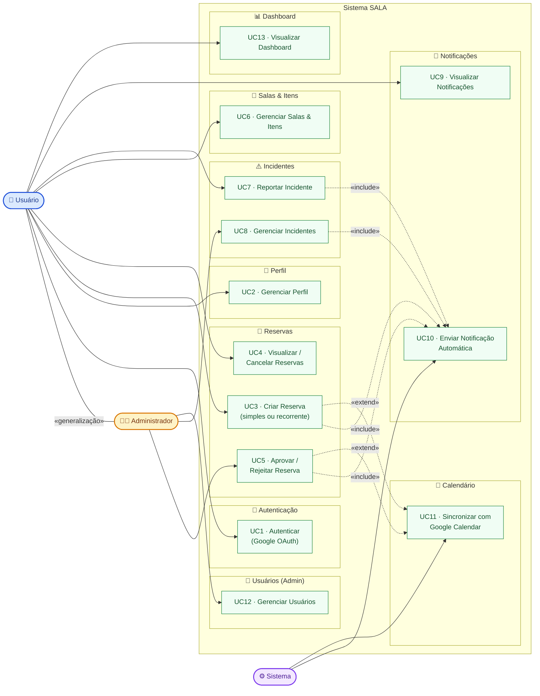

# Diagrama de Casos de Uso - Sistema SALA Web

```mermaid
graph LR
    %% ── Atores ──────────────────────────────────────────────────────
    User(["👤 Usuário"])
    Admin(["👨‍💼 Administrador"])
    Sistema(["⚙️ Sistema"])

    %% Generalização: Admin é um Usuário
    User ---|"«generalização»"| Admin

    %% ── Casos de Uso ─────────────────────────────────────────────────
    subgraph sistema_sala ["Sistema SALA"]

        subgraph auth ["🔐 Autenticação"]
            UC1["UC1 · Autenticar\n(Google OAuth)"]
        end

        subgraph perfil ["👤 Perfil"]
            UC2["UC2 · Gerenciar Perfil"]
        end

        subgraph reservas ["📅 Reservas"]
            UC3["UC3 · Criar Reserva\n(simples ou recorrente)"]
            UC4["UC4 · Visualizar /\nCancelar Reservas"]
            UC5["UC5 · Aprovar /\nRejeitar Reserva"]
        end

        subgraph salas ["🏢 Salas & Itens"]
            UC6["UC6 · Gerenciar Salas & Itens"]
        end

        subgraph incidentes ["⚠️ Incidentes"]
            UC7["UC7 · Reportar Incidente"]
            UC8["UC8 · Gerenciar Incidentes"]
        end

        subgraph notificacoes ["🔔 Notificações"]
            UC9["UC9 · Visualizar Notificações"]
            UC10["UC10 · Enviar Notificação\nAutomática"]
        end

        subgraph calendario ["📆 Calendário"]
            UC11["UC11 · Sincronizar com\nGoogle Calendar"]
        end

        subgraph usuarios_mgmt ["👥 Usuários (Admin)"]
            UC12["UC12 · Gerenciar Usuários"]
        end

        subgraph dashboard ["📊 Dashboard"]
            UC13["UC13 · Visualizar Dashboard"]
        end
    end

    %% ── Relacionamentos – Usuário ────────────────────────────────────
    User --> UC1
    User --> UC2
    User --> UC3
    User --> UC4
    User --> UC6
    User --> UC7
    User --> UC9
    User --> UC13

    %% ── Relacionamentos – Administrador (exclusivos) ─────────────────
    Admin --> UC5
    Admin --> UC8
    Admin --> UC12

    %% ── Relacionamentos – Sistema ─────────────────────────────────────
    Sistema --> UC10
    Sistema --> UC11

    %% ── Dependências entre casos de uso ──────────────────────────────
    UC3 -. "«include»" .-> UC10
    UC5 -. "«include»" .-> UC10
    UC7 -. "«include»" .-> UC10
    UC8 -. "«include»" .-> UC10
    UC3 -. "«extend»" .-> UC11
    UC5 -. "«extend»" .-> UC11

    %% ── Estilos ──────────────────────────────────────────────────────
    classDef actorClass fill:#dbeafe,stroke:#1d4ed8,stroke-width:2px,color:#1e3a8a
    classDef adminClass fill:#fef3c7,stroke:#d97706,stroke-width:2px,color:#78350f
    classDef sistemaClass fill:#f3e8ff,stroke:#7c3aed,stroke-width:2px,color:#4c1d95
    classDef ucClass fill:#f0fdf4,stroke:#15803d,stroke-width:1px,color:#14532d

    class User actorClass
    class Admin adminClass
    class Sistema sistemaClass
    class UC1,UC2,UC3,UC4,UC5,UC6,UC7,UC8,UC9,UC10,UC11,UC12,UC13 ucClass
```

## Atores

| Ator | Descrição |
|------|-----------|
| 👤 **Usuário** | Pessoa autenticada com role `USER`. Acessa reservas, salas, incidentes, notificações e dashboard. |
| 👨‍💼 **Administrador** | Usuário com role `ADMIN`. Herda todos os casos de uso do Usuário e possui permissões exclusivas de gestão. |
| ⚙️ **Sistema** | Ator autônomo que executa ações automaticamente em resposta a eventos de negócio, sem interação direta humana. |

> **Nota de modelagem:** A relação de **generalização** entre Usuário e Administrador expressa que o Admin possui todas as capacidades do Usuário mais as suas exclusivas, refletindo o campo `role` no modelo `User` do Prisma.

---

## Descrição dos Casos de Uso

### 🔐 Autenticação

- **UC1 · Autenticar**: Login/Logout via Google OAuth; app mobile usa token JWT gerado pela API.

### 👤 Perfil

- **UC2 · Gerenciar Perfil**: Visualizar e editar nome e foto de perfil.

### 📅 Reservas

- **UC3 · Criar Reserva**: Criar solicitação (simples ou recorrente: `DAILY`, `WEEKLY`, `MONTHLY`), com verificação de conflitos. Inclui `UC10` e pode estender `UC11`.
- **UC4 · Visualizar/Cancelar Reservas**: Listar, filtrar e cancelar reservas (incluindo instâncias de reservas recorrentes).
- **UC5 · Aprovar/Rejeitar Reserva** *(exclusivo Admin)*: Aprovar ou rejeitar solicitações (individuais ou em lote para recorrentes). Inclui `UC10` e pode estender `UC11`.

### 🏢 Salas & Itens

- **UC6 · Gerenciar Salas & Itens**: Usuário visualiza; Admin cria, edita, exclui e altera status de salas e seus itens.

### ⚠️ Incidentes

- **UC7 · Reportar Incidente**: Usuário reporta problema em sala ou item (categoria, prioridade). Inclui `UC10`.
- **UC8 · Gerenciar Incidentes** *(exclusivo Admin)*: Atribuir responsável, atualizar status, registrar notas e acompanhar histórico. Inclui `UC10`.

### 🔔 Notificações

- **UC9 · Visualizar Notificações**: Ver lista de notificações, marcar como lida/todas lidas, acompanhar contador.
- **UC10 · Enviar Notificação Automática** *(Sistema)*: Emitir notificações in-app e push (via `PushToken`) em eventos de reserva (`RESERVATION_CREATED`, `RESERVATION_APPROVED`, etc.) e incidente (`INCIDENT_CREATED`, `INCIDENT_ASSIGNED`, etc.).

### 📆 Calendário

- **UC11 · Sincronizar com Google Calendar** *(Sistema)*: Criar/atualizar/remover eventos no Google Calendar do usuário ao criar, aprovar ou cancelar uma reserva (`googleCalendarEventId` no schema).

### 👥 Usuários *(exclusivo Admin)*

- **UC12 · Gerenciar Usuários**: Listar, buscar e alterar o role (`ADMIN`/`USER`) de qualquer usuário.

### 📊 Dashboard

- **UC13 · Visualizar Dashboard**: Ver estatísticas de reservas (por status), incidentes (por status/prioridade/categoria) e próximas reservas.
