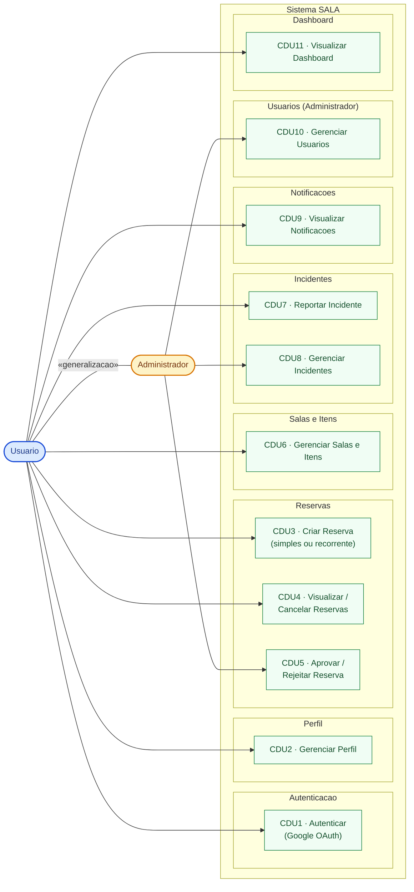

# Diagrama de Casos de Uso - Sistema SALA Web

```mermaid
graph LR
    %% -- Atores --
    User(["Usuario"])
    Admin(["Administrador"])

    %% Generalizacao: Administrador e um Usuario
    User ---|"«generalizacao»"| Admin

    %% -- Casos de Uso --
    subgraph sistema_sala ["Sistema SALA"]

        subgraph auth ["Autenticacao"]
            CDU1["CDU1 · Autenticar\n(Google OAuth)"]
        end

        subgraph perfil ["Perfil"]
            CDU2["CDU2 · Gerenciar Perfil"]
        end

        subgraph reservas ["Reservas"]
            CDU3["CDU3 · Criar Reserva\n(simples ou recorrente)"]
            CDU4["CDU4 · Visualizar /\nCancelar Reservas"]
            CDU5["CDU5 · Aprovar /\nRejeitar Reserva"]
        end

        subgraph salas ["Salas e Itens"]
            CDU6["CDU6 · Gerenciar Salas e Itens"]
        end

        subgraph incidentes ["Incidentes"]
            CDU7["CDU7 · Reportar Incidente"]
            CDU8["CDU8 · Gerenciar Incidentes"]
        end

        subgraph notificacoes ["Notificacoes"]
            CDU9["CDU9 · Visualizar Notificacoes"]
        end

        subgraph usuarios_mgmt ["Usuarios (Administrador)"]
            CDU10["CDU10 · Gerenciar Usuarios"]
        end

        subgraph dashboard ["Dashboard"]
            CDU11["CDU11 · Visualizar Dashboard"]
        end
    end

    %% -- Relacionamentos - Usuario --
    User --> CDU1
    User --> CDU2
    User --> CDU3
    User --> CDU4
    User --> CDU6
    User --> CDU7
    User --> CDU9
    User --> CDU11

    %% -- Relacionamentos - Administrador (exclusivos) --
    Admin --> CDU5
    Admin --> CDU8
    Admin --> CDU10

    %% -- Estilos --
    classDef actorClass fill:#dbeafe,stroke:#1d4ed8,stroke-width:2px,color:#1e3a8a
    classDef adminClass fill:#fef3c7,stroke:#d97706,stroke-width:2px,color:#78350f
    classDef ucClass fill:#f0fdf4,stroke:#15803d,stroke-width:1px,color:#14532d

    class User actorClass
    class Admin adminClass
    class CDU1,CDU2,CDU3,CDU4,CDU5,CDU6,CDU7,CDU8,CDU9,CDU10,CDU11 ucClass
```

## Atores

| Ator | Descrição |
|------|-----------|
| 👤 **Usuário** | Pessoa autenticada com role `USER`. Acessa reservas, salas, incidentes, notificações e dashboard. |
| 👨‍💼 **Administrador** | Usuário com role `ADMIN`. Herda todos os casos de uso do Usuário e possui permissões exclusivas de gestão. |
| ⚙️ **Sistema** | Ator autônomo que executa ações automaticamente em resposta a eventos de negócio, sem interação direta humana. |

> **Nota de modelagem:** A relação de **generalização** entre Usuário e Administrador expressa que o Admin possui todas as capacidades do Usuário mais as suas exclusivas, refletindo o campo `role` no modelo `User` do Prisma.

---

> **Nota de modelagem:** Em UML, atores sao entidades **externas** ao sistema que interagem com ele. O sistema em si nunca e ator — comportamentos internos automaticos (envio de notificacoes, sincronizacao com Google Calendar) sao modelados como fluxos, pos-condicoes e regras de negocio dos casos de uso que os disparam, nao como casos de uso autonomos sem ator iniciador.

## Atores

| Ator | Descricao |
|------|-----------|
| **Usuario** | Pessoa autenticada com role `USER`. Interage com reservas, salas, incidentes, notificacoes e dashboard. |
| **Administrador** | Usuario com role `ADMIN`. Herda todos os casos de uso do Usuario e possui permissoes exclusivas de gestao. A relacao de **generalizacao** reflete o campo `role` no modelo `User` do Prisma. |

---

## Descricao dos Casos de Uso

---

### CDU1 - Autenticar

| Campo | Conteudo |
|-------|----------|
| **Descricao** | Permite que o usuario realize login e logout no sistema via Google OAuth 2.0. O aplicativo mobile utiliza um token JWT gerado pela API para autenticacao. |
| **Ator Principal** | Usuario (inclui Administrador) |
| **Pre-condicao** | O usuario possui uma conta Google valida. |
| **Pos-condicao** | Sessao autenticada criada (web via NextAuth) ou token JWT retornado (mobile). O usuario e redirecionado para a pagina inicial do sistema. |

**Fluxo Principal:**
1. Usuario acessa a pagina de login.
2. Clica em "Entrar com Google".
3. Sistema redireciona para autenticacao Google OAuth 2.0.
4. Google autentica o usuario e retorna a aplicacao.
5. Sistema verifica se a conta existe; se nao, cria automaticamente com role `USER`.
6. Sessao e iniciada e o usuario e redirecionado ao dashboard.

**Fluxo Alternativo:**
- **FA1 - Login mobile:** O mobile chama `POST /api/auth/mobile-token` com as credenciais Google; o sistema retorna um JWT com prazo de expiracao.
- **FA2 - Autenticacao falha:** Credenciais invalidas ou permissao negada no Google: sistema exibe mensagem de erro e retorna a tela de login.
- **FA3 - Logout:** Usuario clica em "Sair": sistema encerra a sessao e redireciona para a tela de login.

**Regras de Negocio:**
- `RN01` - A conta e criada automaticamente no primeiro login (provisionamento just-in-time).
- `RN02` - Role padrao ao criar conta e `USER`; somente um Administrador pode elevar para `ADMIN`.
- `RN03` - Tokens mobile expiram apos periodo configurado; renovacao requer novo login.

---

### CDU2 - Gerenciar Perfil

| Campo | Conteudo |
|-------|----------|
| **Descricao** | Permite que o usuario visualize e edite suas informacoes pessoais (nome e foto de perfil). |
| **Ator Principal** | Usuario (inclui Administrador) |
| **Pre-condicao** | Usuario autenticado (CDU1 concluido). |
| **Pos-condicao** | Informacoes de perfil atualizadas e persistidas no banco de dados. |

**Fluxo Principal:**
1. Usuario acessa a pagina de perfil.
2. Sistema exibe nome, e-mail, foto, role e data de criacao da conta.
3. Usuario edita nome e/ou faz upload de nova foto.
4. Sistema valida os dados e persiste as alteracoes via `PATCH /api/users/[userId]`.
5. Confirmacao de sucesso e exibida.

**Fluxo Alternativo:**
- **FA1 - Dados invalidos:** Nome em branco ou arquivo de imagem invalido: sistema exibe mensagem de validacao sem salvar.
- **FA2 - Falha no upload de imagem:** Cloudinary indisponivel: sistema exibe erro e mantem foto anterior.

**Regras de Negocio:**
- `RN04` - O usuario so pode editar o proprio perfil; Administrador pode editar qualquer perfil.
- `RN05` - O campo e-mail e somente leitura (gerenciado pelo Google OAuth).
- `RN06` - Imagens de perfil sao armazenadas no Cloudinary e otimizadas automaticamente.

---

### CDU3 - Criar Reserva

| Campo | Conteudo |
|-------|----------|
| **Descricao** | Permite ao usuario criar uma solicitacao de reserva de sala, simples ou recorrente (`DAILY`, `WEEKLY`, `MONTHLY`), com verificacao automatica de conflitos de horario. |
| **Ator Principal** | Usuario (inclui Administrador) |
| **Pre-condicao** | Usuario autenticado. Existe ao menos uma sala com status `LIVRE` ou `RESERVADO`. |
| **Pos-condicao** | Reserva criada com status `PENDING` (Usuario) ou `APPROVED` (Administrador). Notificacao enviada automaticamente ao(s) Administrador(es). Se o usuario possui conta Google com permissao de calendario vinculada, evento e criado no Google Calendar. |

**Fluxo Principal:**
1. Usuario acessa a pagina de agendamentos ou o detalhe de uma sala.
2. Preenche o formulario: sala, data, horario de inicio e fim, proposito (opcional).
3. (Opcional) Ativa recorrencia: seleciona padrao (`DAILY`, `WEEKLY`, `MONTHLY`), dias da semana e data de termino.
4. Sistema verifica conflitos via `POST /api/reservations/check-conflict`.
5. Sem conflito: sistema cria a reserva (ou conjunto de instancias recorrentes vinculadas ao template pai).
6. Sistema envia notificacao automatica ao(s) Administrador(es) informando a nova solicitacao.
7. Se o usuario possui conta Google vinculada com escopo de calendario, o sistema sincroniza o evento no Google Calendar do usuario.
8. Usuario recebe confirmacao de sucesso e a listagem e atualizada.

**Fluxo Alternativo:**
- **FA1 - Conflito de horario:** Reserva sobreposta detectada: sistema retorna mensagem de erro detalhada; usuario escolhe outro horario.
- **FA2 - Sala indisponivel:** Status da sala e `EM_USO`: sistema bloqueia a criacao e orienta o usuario.
- **FA3 - Administrador cria reserva:** Status inicial e automaticamente `APPROVED`; notificacao ao Administrador nao e enviada.
- **FA4 - Recorrencia parcialmente conflitante:** Algumas instancias conflitam: sistema cria apenas as nao conflitantes e informa quais foram ignoradas.
- **FA5 - Conta Google sem permissao de calendario:** Sincronizacao e ignorada; reserva e criada normalmente no banco.

**Regras de Negocio:**
- `RN07` - Conflitos consideram reservas com status `ACTIVE`, `APPROVED` e `PENDING`.
- `RN08` - Para reservas `WEEKLY`, os dias da semana devem ser informados (campo `recurringDaysOfWeek`).
- `RN09` - Todas as instancias recorrentes sao vinculadas por `recurringTemplateId`.
- `RN10` - Reservas criadas por Administrador sao automaticamente aprovadas.
- `RN11` - A sincronizacao com o Google Calendar e best-effort: falhas na API externa nao bloqueiam a criacao da reserva.
- `RN12` - O ID do evento criado no Google Calendar e persistido em `Reservation.googleCalendarEventId`.

---

### CDU4 - Visualizar / Cancelar Reservas

| Campo | Conteudo |
|-------|----------|
| **Descricao** | Permite ao usuario listar, filtrar, visualizar detalhes e cancelar suas reservas. Administradores visualizam todas as reservas do sistema. |
| **Ator Principal** | Usuario (inclui Administrador) |
| **Pre-condicao** | Usuario autenticado. |
| **Pos-condicao** | Reserva cancelada com status `CANCELLED`. Notificacao de cancelamento enviada automaticamente. Evento correspondente removido do Google Calendar, se existente. |

**Fluxo Principal:**
1. Usuario acessa a lista de reservas.
2. Sistema exibe as reservas do usuario com filtros por status, data e sala. Administrador visualiza todas as reservas.
3. Usuario seleciona uma reserva e visualiza os detalhes.
4. Usuario solicita o cancelamento.
5. Sistema atualiza o status para `CANCELLED` via `PATCH /api/reservations/[id]`.
6. Sistema envia notificacao de cancelamento automaticamente.
7. Se havia evento vinculado no Google Calendar, o sistema o remove via Google Calendar API.

**Fluxo Alternativo:**
- **FA1 - Cancelamento de reserva recorrente:** Sistema oferece opcao de cancelar apenas a instancia selecionada ou toda a serie.
- **FA2 - Reserva ja cancelada ou rejeitada:** Opcao de cancelamento nao e exibida; status e apenas informativo.
- **FA3 - Falha ao remover evento do Google Calendar:** Cancelamento e registrado no banco normalmente; falha na API externa e registrada em log sem impacto para o usuario.

**Regras de Negocio:**
- `RN13` - Usuario so pode cancelar suas proprias reservas; Administrador pode cancelar qualquer reserva.
- `RN14` - Reservas com status `COMPLETED` nao podem ser canceladas.
- `RN15` - Cancelamento de serie recorrente pode ser parcial (instancia unica) ou total (todas as instancias futuras).

---

### CDU5 - Aprovar / Rejeitar Reserva *(exclusivo Administrador)*

| Campo | Conteudo |
|-------|----------|
| **Descricao** | Permite ao Administrador aprovar ou rejeitar solicitacoes de reserva pendentes, individualmente ou em lote para reservas recorrentes. |
| **Ator Principal** | Administrador |
| **Pre-condicao** | Usuario autenticado com role `ADMIN`. Existem reservas com status `PENDING`. |
| **Pos-condicao** | Reserva com status `APPROVED` ou `REJECTED`. Notificacao enviada automaticamente ao solicitante. Se aprovada e usuario possui Google Calendar vinculado, evento criado ou atualizado. Se rejeitada, evento removido do Google Calendar, se existente. |

**Fluxo Principal:**
1. Administrador acessa a tela de aprovacoes e solicitacoes.
2. Sistema lista reservas com status `PENDING`.
3. Administrador seleciona uma reserva e escolhe aprovar ou rejeitar.
4. Sistema atualiza o status via `POST /api/reservations/approve` (ou `/[id]/approve` / `/[id]/reject`).
5. Sistema envia notificacao automatica ao solicitante informando a decisao.
6. Se aprovada e usuario possui Google Calendar vinculado: sistema cria ou atualiza o evento no Google Calendar.
7. Se rejeitada e evento existia no Google Calendar: sistema remove o evento.

**Fluxo Alternativo:**
- **FA1 - Reserva recorrente:** Administrador pode aprovar ou rejeitar todas as instancias vinculadas ao template de uma vez.
- **FA2 - Conflito detectado na aprovacao:** Se outra reserva `APPROVED` colide no intervalo, sistema alerta o Administrador antes de confirmar.
- **FA3 - Falha na API do Google Calendar:** Aprovacao e registrada normalmente; falha e registrada em log sem impacto para o usuario.

**Regras de Negocio:**
- `RN16` - Apenas usuarios com role `ADMIN` podem executar este caso de uso.
- `RN17` - A aprovacao ou rejeicao em lote afeta todas as instancias vinculadas ao mesmo `recurringTemplateId`.
- `RN18` - A sincronizacao com o Google Calendar e best-effort: falhas na API externa nao revertam a decisao de aprovacao ou rejeicao.

---

### CDU6 - Gerenciar Salas e Itens

| Campo | Conteudo |
|-------|----------|
| **Descricao** | Permite a visualizacao de salas a todos os usuarios. Administradores podem criar, editar, excluir salas e gerenciar os itens e equipamentos associados. |
| **Ator Principal** | Usuario (visualizacao) / Administrador (gestao completa) |
| **Pre-condicao** | Usuario autenticado. |
| **Pos-condicao** | Sala ou item criado, atualizado ou excluido. Status da sala refletido para todos os usuarios. |

**Fluxo Principal (visualizacao - Usuario):**
1. Usuario acessa a lista de salas.
2. Sistema exibe salas com nome, descricao, capacidade, status e itens disponiveis.
3. Usuario filtra por status ou capacidade e visualiza detalhes.

**Fluxo Principal (gestao - Administrador):**
1. Administrador acessa a lista de salas.
2. Cria nova sala (nome, descricao, capacidade) via `POST /api/rooms`.
3. Edita informacoes ou altera status (`LIVRE`, `EM_USO`, `RESERVADO`) via `PATCH /api/rooms/[id]`.
4. Adiciona, edita ou remove itens da sala via `POST|PATCH|DELETE /api/items`.
5. Faz upload de imagens dos itens via `POST /api/uploads`.

**Fluxo Alternativo:**
- **FA1 - Exclusao com reservas ativas:** Sistema impede a exclusao da sala se existirem reservas `ACTIVE` ou `APPROVED` associadas.
- **FA2 - Falha no upload de imagem:** Cloudinary indisponivel: sistema mantem imagem anterior e exibe mensagem de erro.

**Regras de Negocio:**
- `RN19` - Apenas Administrador pode criar, editar ou excluir salas e itens.
- `RN20` - Status da sala e gerenciado de forma independente do ciclo de reservas.
- `RN21` - A exclusao de uma sala remove em cascata os itens e imagens associados.

---

### CDU7 - Reportar Incidente

| Campo | Conteudo |
|-------|----------|
| **Descricao** | Permite ao usuario reportar um problema ou ocorrencia relacionada a uma sala ou item, informando categoria e prioridade. |
| **Ator Principal** | Usuario (inclui Administrador) |
| **Pre-condicao** | Usuario autenticado. Existe ao menos uma sala ou item cadastrado no sistema. |
| **Pos-condicao** | Incidente criado com status `REPORTED`. Primeiro registro criado em `IncidentStatusHistory`. Notificacao enviada automaticamente a todos os Administradores. |

**Fluxo Principal:**
1. Usuario acessa a pagina de incidentes ou o detalhe de uma sala ou item.
2. Preenche o formulario: titulo, descricao, categoria (`EQUIPMENT_FAILURE`, `INFRASTRUCTURE`, etc.), prioridade (`LOW`, `MEDIUM`, `HIGH`, `CRITICAL`) e referencia (sala ou item).
3. Sistema cria o incidente via `POST /api/incidents` com status `REPORTED`.
4. Sistema registra o primeiro historico em `IncidentStatusHistory`.
5. Sistema envia notificacao automatica a todos os Administradores.

**Fluxo Alternativo:**
- **FA1 - Dados incompletos:** Campos obrigatorios ausentes: sistema valida via Zod e retorna erros por campo.
- **FA2 - Sala ou item nao encontrado:** Referencia invalida: sistema rejeita o formulario com mensagem de erro.

**Regras de Negocio:**
- `RN22` - Status inicial de qualquer incidente sempre e `REPORTED`.
- `RN23` - Categoria e prioridade sao campos obrigatorios.
- `RN24` - O incidente deve estar associado a uma sala ou a um item (nao ambos simultaneamente).
- `RN25` - O campo `reportedById` e preenchido automaticamente com o ID do usuario autenticado.

---

### CDU8 - Gerenciar Incidentes *(exclusivo Administrador)*

| Campo | Conteudo |
|-------|----------|
| **Descricao** | Permite ao Administrador gerenciar o ciclo de vida completo dos incidentes: atribuir responsavel, atualizar status, registrar notas de resolucao e acompanhar o historico de mudancas. |
| **Ator Principal** | Administrador |
| **Pre-condicao** | Usuario autenticado com role `ADMIN`. Existe ao menos um incidente cadastrado. |
| **Pos-condicao** | Incidente atualizado (status, responsavel, notas). Novo registro adicionado em `IncidentStatusHistory`. Notificacao enviada automaticamente ao usuario envolvido. |

**Fluxo Principal:**
1. Administrador acessa a tela de gestao de incidentes.
2. Sistema exibe lista com filtros (status, prioridade, categoria, sala ou item).
3. Administrador seleciona um incidente e visualiza o historico de mudancas.
4. Administrador atribui responsavel, altera status e registra notas via `PATCH /api/incidents/[id]`.
5. Sistema cria registro em `IncidentStatusHistory` com `fromStatus`, `toStatus`, `notes` e `changedById`.
6. Sistema envia notificacao automatica ao usuario que reportou o incidente ou ao responsavel designado.

**Fluxo Alternativo:**
- **FA1 - Incidente ja resolvido ou cancelado:** Sistema impede alteracoes de status a partir dos estados finais.
- **FA2 - Reatribuicao de responsavel:** Administrador pode reatribuir a qualquer usuario listado por `GET /api/incidents/assignable-users`.

**Regras de Negocio:**
- `RN26` - Apenas Administrador pode alterar status, atribuir responsavel e registrar notas.
- `RN27` - Toda mudanca de status gera um registro imutavel em `IncidentStatusHistory`.
- `RN28` - Estados finais: `RESOLVED` e `CANCELLED`. A partir deles nao ha transicao de saida.
- `RN29` - O campo `actualResolutionTime` e preenchido automaticamente ao transitar para `RESOLVED`.

---

### CDU9 - Visualizar Notificacoes

| Campo | Conteudo |
|-------|----------|
| **Descricao** | Permite ao usuario visualizar suas notificacoes, diferenciando lidas e nao lidas, e marca-las como lidas individualmente ou em lote. |
| **Ator Principal** | Usuario (inclui Administrador) |
| **Pre-condicao** | Usuario autenticado. |
| **Pos-condicao** | Notificacoes marcadas como lidas. Contador de nao lidas atualizado. |

**Fluxo Principal:**
1. Usuario acessa o centro de notificacoes.
2. Sistema exibe lista de notificacoes via `GET /api/notifications`, com diferenciacao visual entre lidas e nao lidas.
3. Contador de nao lidas e obtido via `GET /api/notifications/count`.
4. Usuario marca notificacoes como lidas individualmente ou aciona "Marcar todas como lidas" via `POST /api/notifications/mark-all-read`.
5. Contador e atualizado em tempo real.

**Fluxo Alternativo:**
- **FA1 - Nenhuma notificacao:** Sistema exibe estado vazio com mensagem informativa.
- **FA2 - Filtro por tipo:** Usuario filtra notificacoes por tipo (reservas, incidentes, sistema).

**Regras de Negocio:**
- `RN30` - Cada notificacao pertence exclusivamente ao usuario-alvo (`userId`).
- `RN31` - Notificacoes nao sao excluidas apos leitura; apenas o campo `isRead` e atualizado.
- `RN32` - O contador exibe apenas notificacoes com `isRead = false`.
- `RN33` - Notificacoes sao geradas automaticamente pelo sistema em resposta aos seguintes eventos: criacao de reserva (`RESERVATION_CREATED`), aprovacao (`RESERVATION_APPROVED`), rejeicao (`RESERVATION_REJECTED`), cancelamento (`RESERVATION_CANCELLED`), criacao de incidente (`INCIDENT_CREATED`), atribuicao de incidente (`INCIDENT_ASSIGNED`) e mudanca de status de incidente (`INCIDENT_STATUS_CHANGED`, `INCIDENT_RESOLVED`).
- `RN34` - Quando o usuario possui um `PushToken` ativo registrado, as notificacoes tambem sao enviadas via push notification para o aplicativo mobile.

---

### CDU10 - Gerenciar Usuarios *(exclusivo Administrador)*

| Campo | Conteudo |
|-------|----------|
| **Descricao** | Permite ao Administrador listar, buscar e alterar o role dos usuarios cadastrados no sistema. |
| **Ator Principal** | Administrador |
| **Pre-condicao** | Usuario autenticado com role `ADMIN`. |
| **Pos-condicao** | Role do usuario atualizado. Permissoes refletidas imediatamente nas proximas requisicoes do usuario afetado. |

**Fluxo Principal:**
1. Administrador acessa a tela de gerenciamento de usuarios.
2. Sistema lista todos os usuarios via `GET /api/users`, com filtros por role e busca por nome ou e-mail.
3. Administrador seleciona um usuario e altera o role (`USER` para `ADMIN` ou vice-versa).
4. Sistema atualiza via `PATCH /api/users/[userId]` e registra a alteracao.

**Fluxo Alternativo:**
- **FA1 - Auto-alteracao de role:** Sistema impede que o Administrador rebaixe o proprio role para evitar bloqueio de acesso ao sistema.
- **FA2 - Usuario nao encontrado:** Sistema retorna erro 404.

**Regras de Negocio:**
- `RN35` - Apenas Administradores podem visualizar a lista completa de usuarios e alterar roles.
- `RN36` - Um Administrador nao pode alterar o proprio role.
- `RN37` - A alteracao de role tem efeito imediato na proxima requisicao do usuario afetado.

---

### CDU11 - Visualizar Dashboard

| Campo | Conteudo |
|-------|----------|
| **Descricao** | Exibe um painel consolidado com estatisticas de reservas, incidentes e utilizacao do sistema. Administradores visualizam dados globais; usuarios comuns visualizam apenas os proprios dados. |
| **Ator Principal** | Usuario (inclui Administrador) |
| **Pre-condicao** | Usuario autenticado. |
| **Pos-condicao** | Dados de estatisticas exibidos e atualizados conforme o papel do usuario. |

**Fluxo Principal:**
1. Usuario acessa o dashboard.
2. Sistema carrega estatisticas de reservas por status via `GET /api/reservations/user/[userId]/stats`.
3. Sistema carrega estatisticas de incidentes por status, prioridade e categoria via `GET /api/incidents/stats` (restrito a Administrador).
4. Dashboard exibe proximas reservas, contadores e graficos.

**Fluxo Alternativo:**
- **FA1 - Sem dados:** Nenhuma reserva ou incidente registrado: sistema exibe estado vazio com mensagem orientativa.
- **FA2 - Filtro por periodo:** Usuario seleciona intervalo de datas para filtrar as estatisticas.

**Regras de Negocio:**
- `RN38` - Usuario comum visualiza apenas estatisticas das proprias reservas.
- `RN39` - Administrador visualiza estatisticas globais do sistema (todas as reservas e todos os incidentes).
- `RN40` - Dados do dashboard sao obtidos em tempo real para garantir precisao.
