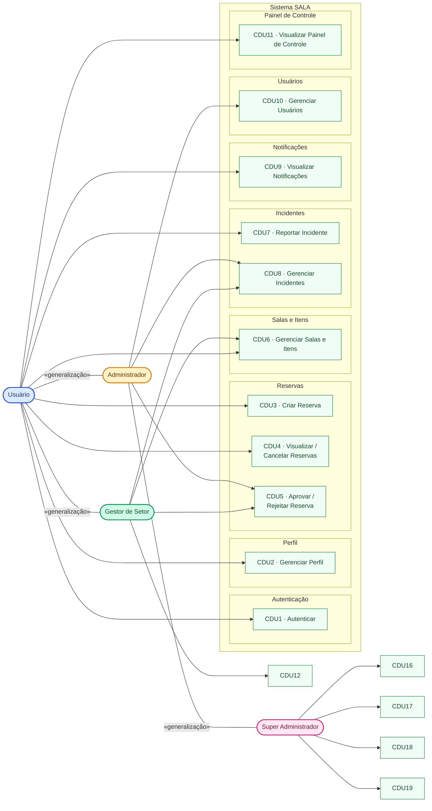

# Diagrama de Casos de Uso - Sistema SALA Web

```mermaid
graph LR
    %% -- Atores --
    User(["Usuário"])
    Admin(["Administrador"])
    SuperAdmin(["Super Administrador"])
    Gestor(["Gestor de Setor"])

    %% Generalizacao: Administrador e um Usuario
    User ---|"«generalização»"| Admin
    Admin ---|"«generalização»"| SuperAdmin
    User ---|"«generalização»"| Gestor

    %% -- Casos de Uso --
    subgraph sistema_sala ["Sistema SALA"]

        subgraph auth ["Autenticação"]
            CDU1["CDU1 · Autenticar"]
        end

        subgraph perfil ["Perfil"]
            CDU2["CDU2 · Gerenciar Perfil"]
        end

        subgraph reservas ["Reservas"]
            CDU3["CDU3 · Criar Reserva"]
            CDU4["CDU4 · Visualizar /\nCancelar Reservas"]
            CDU5["CDU5 · Aprovar /\nRejeitar Reserva"]
        end

        subgraph salas ["Salas e Itens"]
            CDU6["CDU6 · Gerenciar Salas e Itens"]
        end

        subgraph incidentes ["Incidentes"]
            CDU7["CDU7 · Reportar Incidente"]
            CDU8["CDU8 · Gerenciar Incidentes"]
        end

        subgraph notificacoes ["Notificações"]
            CDU9["CDU9 · Visualizar Notificações"]
        end

        subgraph usuarios_mgmt ["Usuários"]
            CDU10["CDU10 · Gerenciar Usuários"]
        end

        subgraph dashboard ["Painel de Controle"]
            CDU11["CDU11 · Visualizar Painel de Controle"]
        end
    end

    %% -- Relacionamentos - Usuario --
    User --> CDU1
    User --> CDU2
    User --> CDU3
    User --> CDU4
    User --> CDU6
    User --> CDU7
    User --> CDU9
    User --> CDU11

    %% -- Relacionamentos - Gestor (escopo de setor) --
    Gestor --> CDU5
    Gestor --> CDU6
    Gestor --> CDU8
    Gestor --> CDU12
    %% -- Relacionamentos - Administrador (exclusivos) --
    Admin --> CDU5
    Admin --> CDU8
    Admin --> CDU10

    %% -- Relacionamentos - Super Administrador --
    SuperAdmin --> CDU16
    SuperAdmin --> CDU17
    SuperAdmin --> CDU18
    SuperAdmin --> CDU19

    %% -- Estilos --
    classDef actorClass fill:#dbeafe,stroke:#1d4ed8,stroke-width:2px,color:#1e3a8a
    classDef adminClass fill:#fef3c7,stroke:#d97706,stroke-width:2px,color:#78350f
    classDef superAdminClass fill:#fce7f3,stroke:#db2777,stroke-width:2px,color:#831843
    classDef gestorClass fill:#d1fae5,stroke:#059669,stroke-width:2px,color:#064e3b
    classDef ucClass fill:#f0fdf4,stroke:#15803d,stroke-width:1px,color:#14532d

    class User actorClass
    class Admin adminClass
    class SuperAdmin superAdminClass
    class Gestor gestorClass
    class CDU1,CDU2,CDU3,CDU4,CDU5,CDU6,CDU7,CDU8,CDU9,CDU10,CDU11,CDU12,CDU13,CDU14,CDU15,CDU16,CDU17,CDU18,CDU19 ucClass

    classDef extSystem fill:#fce7f3,stroke:#db2777,stroke-width:2px,color:#831843
    class GoogleOAuth,GoogleCalendar extSystem
```

## Atores

| Ator | Descrição |
|------|-----------|
| **Usuário** | Pessoa autenticada com perfil padrão de acesso. Interage com reservas, salas, incidentes, notificações e painel de controle. |
| **Administrador** | Usuário com perfil gerencial. Herda todos os casos de uso do Usuário e possui permissões exclusivas de gestão. A relação de generalização reflete a elevação de privilégios no modelo de dados. |
| **Gestor de Setor** | Usuário com atribuições específicas de supervisão sobre um conjunto delimitado de espaços. |
| **Super Administrador** | Ator responsável pela administração global da plataforma, incluindo a configuração de planos e o monitoramento das organizações. |

---

> **Nota de modelagem:** Em UML, atores são entidades externas ao sistema que interagem com ele. O sistema em si nunca é ator — comportamentos internos automáticos (envio de notificações, sincronização de calendários) são modelados como fluxos, pós-condições e regras de negócio dos casos de uso que os disparam, não como casos de uso autônomos sem ator iniciador.

---

## Descrição dos Casos de Uso

---

### CDU1 - Autenticar

| Campo | Conteúdo |
|-------|----------|
| **Descrição** | Este caso de uso tem por objetivo prover o mecanismo de controle de acesso à aplicação, permitindo que os atores estabeleçam ou encerrem uma sessão válida por intermédio de provedor de identidade externo ou por meio de credenciais tradicionais (correio eletrônico e senha), garantindo a identificação unívoca no sistema. |
| **Ator Principal** | Usuário |
| **Pré-condição** | O usuário possui credenciais válidas ou uma conta habilitada no provedor de identidade externo. |
| **Pós-condição** | Sessão autenticada criada e usuário redirecionado para a tela inicial do sistema. |

**Fluxo Principal:**
1. Usuário acessa a página de autenticação.
2. Seleciona a opção de entrar com provedor externo.
3. Sistema redireciona para a interface de autorização do provedor.
4. O provedor autentica o usuário e retorna o controle à aplicação.
5. Sistema verifica se a conta existe; caso contrário, cria o registro automaticamente com o perfil padrão de acesso.
6. A sessão é iniciada e o usuário é redirecionado ao painel de controle.

**Fluxo Alternativo:**
- **FA1 - Autenticação móvel:** O aplicativo móvel envia credenciais para a interface de programação do sistema, que retorna um identificador de sessão criptografado com prazo de expiração.
- **FA2 - Autenticação falha:** Credenciais inválidas ou permissão negada: o sistema exibe mensagem de erro e retorna à tela de autenticação.
- **FA3 - Encerramento de sessão:** O usuário seleciona a opção de sair: o sistema encerra a sessão ativa e redireciona para a tela de autenticação.

**Regras de Negócio:**
- `RN01` - A conta é criada automaticamente no primeiro acesso bem-sucedido.
- `RN02` - O perfil padrão atribuído ao criar uma nova conta restringe-se a permissões básicas; a elevação de privilégios requer intervenção de um administrador.

---

### CDU2 - Gerenciar Perfil

| Campo | Conteúdo |
|-------|----------|
| **Descrição** | Consiste na funcionalidade que possibilita aos atores a visualização e atualização de seus dados cadastrais e preferências pessoais (como nome de exibição e fotografia), assegurando a manutenção da sua identidade dentro da plataforma. |
| **Ator Principal** | Usuário |
| **Pré-condição** | O usuário deve estar previamente autenticado. |
| **Pós-condição** | As informações de perfil são atualizadas e consolidadas no banco de dados. |

**Fluxo Principal:**
1. Usuário acessa a seção de configurações de perfil.
2. O sistema apresenta os dados atuais, como nome, correio eletrônico, fotografia e data de ingresso.
3. O usuário edita as informações textuais ou envia uma nova fotografia.
4. O sistema valida os dados e persiste as alterações na base de dados.
5. Uma confirmação visual de sucesso é apresentada.

**Fluxo Alternativo:**
- **FA1 - Informações inválidas:** Se os dados fornecidos não atenderem aos critérios mínimos, o sistema exibe mensagens informativas e interrompe a gravação.
- **FA2 - Falha no processamento de arquivos:** Caso ocorra indisponibilidade no serviço de armazenamento de imagens, o sistema exibe um alerta de falha e mantém a fotografia anterior.

**Regras de Negócio:**
- `RN03` - Atores com perfil padrão só podem alterar seus próprios registros. Administradores podem realizar modificações nos cadastros de terceiros.
- `RN04` - O endereço de correio eletrônico oriundo do provedor de identidade externo não pode ser alterado manualmente.

---

### CDU3 - Criar Reserva

| Campo | Conteúdo |
|-------|----------|
| **Descrição** | Descreve o processo pelo qual um ator solicita a alocação de um espaço físico para um determinado período. O sistema suporta reservas únicas e padronizadas de forma periódica (diária, semanal ou mensal), executando validações algorítmicas de disponibilidade para a prevenção de conflitos de agendamento. |
| **Ator Principal** | Usuário |
| **Pré-condição** | Usuário autenticado. O sistema deve possuir ao menos um ambiente físico cadastrado e em condições de uso. |
| **Pós-condição** | Solicitação de reserva registrada com estado pendente (se houver exigência de aprovação) ou aprovada (caso contrário). Os interessados são notificados. |

**Fluxo Principal:**
1. Usuário acessa a interface de agendamentos.
2. Preenche o formulário informando o ambiente físico, a data, o intervalo de horas e a finalidade da reserva.
3. Opcionalmente, o usuário configura um padrão de recorrência, definindo os dias e a data de encerramento da repetição.
4. O sistema executa rotinas de verificação para garantir a ausência de conflitos no mesmo período e espaço físico.
5. Inexistindo sobreposição, o sistema consolida a reserva.
6. Uma comunicação assíncrona é enviada automaticamente aos gestores responsáveis.
7. Se o usuário houver autorizado a integração, o sistema replica o evento em sua agenda digital externa.
8. A interface atualiza a listagem de reservas e exibe uma confirmação.

**Fluxo Alternativo:**
- **FA1 - Sobreposição de horários:** Caso o sistema detecte indisponibilidade no período, uma notificação detalhada é apresentada, exigindo a seleção de um novo horário.
- **FA2 - Intervenção administrativa:** Reservas criadas por atores com privilégios gerenciais são consideradas automaticamente deferidas, suprimindo a etapa de notificação de pendência.
- **FA3 - Recorrência com conflitos pontuais:** Se parte dos eventos periódicos conflitar com agendamentos existentes, o sistema consolida apenas as instâncias viáveis e emite um relatório das omissões.

**Regras de Negócio:**
- `RN05` - O algoritmo de verificação de disponibilidade considera solicitações pendentes e aprovadas como bloqueios efetivos do período.
- `RN06` - Espaços configurados sem necessidade de avaliação prévia concedem aprovação imediata à reserva solicitada.
- `RN07` - A sincronização com agendas externas possui caráter de melhor esforço; indisponibilidades na integração não inviabilizam a reserva primária.

---

### CDU4 - Visualizar / Cancelar Reservas

| Campo | Conteúdo |
|-------|----------|
| **Descrição** | Permite a consulta, aplicação de filtros estruturados e o acompanhamento do detalhamento das alocações de espaços efetuadas. Adicionalmente, engloba o procedimento de cancelamento de reservas, com variação de visibilidade baseada nos privilégios hierárquicos do ator. |
| **Ator Principal** | Usuário |
| **Pré-condição** | Usuário autenticado. |
| **Pós-condição** | O agendamento tem seu estado alterado para cancelado. As partes envolvidas recebem comunicados de aviso. |

**Fluxo Principal:**
1. O usuário acessa a listagem geral de agendamentos.
2. O sistema exibe os registros pertinentes ao ator, permitindo a utilização de filtros temporais e situacionais. Administradores possuem visão abrangente.
3. O ator seleciona um registro específico para acessar seus pormenores.
4. O ator aciona o comando de cancelamento.
5. O sistema revoga a validade da alocação.
6. Avisos de desmarcação são propagados automaticamente.
7. Caso haja eventos integrados em agendas externas, solicita-se a remoção dos mesmos.

**Fluxo Alternativo:**
- **FA1 - Cancelamento em lote:** Diante de uma reserva periódica, o sistema faculta a opção de anular um evento isolado ou a integralidade da série remanescente.
- **FA2 - Ação não permitida:** Agendamentos já findados ou previamente rejeitados não apresentam opção de cancelamento, possuindo estado imutável.

**Regras de Negócio:**
- `RN08` - Atuantes com perfil padrão detêm autoridade de anulação unicamente sobre suas próprias requisições. Administradores podem intervir em qualquer registro.
- `RN09` - Ações vinculadas a eventos cuja data de ocorrência já foi superada são permanentemente bloqueadas.

---

### CDU5 - Aprovar / Rejeitar Reserva

| Campo | Conteúdo |
|-------|----------|
| **Descrição** | Compreende o fluxo de deliberação administrativa sobre as solicitações de reserva. Os atores responsáveis avaliam as demandas de alocação de espaços, emitindo parecer favorável ou desfavorável, atualizando o estado do registro e disparando as comunicações pertinentes. O escopo de atuação é delimitado pelas jurisdições setoriais da instituição. |
| **Ator Principal** | Administrador ou Gestor de Setor |
| **Pré-condição** | O ator deve estar autenticado e dotado de competências de avaliação. Deve haver solicitações em estado de pendência sob sua alçada. |
| **Pós-condição** | O registro assume um estado definitivo (aprovado ou reprovado), mantendo rastreabilidade da decisão. O requisitante é notificado da conclusão. |

**Fluxo Principal:**
1. O avaliador acessa o painel de deliberações.
2. O sistema apura e exibe as demandas pendentes que recaem sob a responsabilidade do ator logado.
3. O avaliador seleciona um registro e determina a aceitação ou a recusa do pleito.
4. O sistema valida a competência jurisdicional e formaliza a decisão, anexando as devidas justificativas.
5. Uma correspondência informativa é encaminhada ao solicitante original.
6. Em caso de aprovação, rotinas auxiliares de sincronização de agenda externa podem ser acionadas.

**Fluxo Alternativo:**
- **FA1 - Deliberação em lote:** Em solicitações de caráter periódico, a decisão pode ser replicada automaticamente para todas as incidências correlatas.
- **FA2 - Impedimento jurisdicional:** A tentativa de avaliar um ambiente fora do setor de competência do gestor resulta em bloqueio de acesso.

**Regras de Negócio:**
- `RN10` - Administradores globais possuem competência irrestrita. Gestores de setor operam estritamente sobre os ambientes físicos sob a tutela de seus respectivos departamentos.
- `RN11` - Ações homologatórias exigem registro inalterável contendo a identificação do avaliador e o momento exato da deliberação.

---

### CDU6 - Gerenciar Salas e Itens

| Campo | Conteúdo |
|-------|----------|
| **Descrição** | Engloba o gerenciamento completo do catálogo de recursos espaciais (ambientes físicos) e patrimoniais (objetos). Proporciona a visualização pública de recursos e o controle administrativo para a criação, alteração de atributos, inativação e alocação física de bens patrimoniais, operando sob rigorosa validação baseada no perfil e jurisdição institucional do ator. |
| **Ator Principal** | Administrador e Gestor de Setor (para edição); Usuário (para leitura) |
| **Pré-condição** | Usuário autenticado na plataforma. |
| **Pós-condição** | O ambiente ou bem material é cadastrado, alterado ou suprimido. As modificações são refletidas nos relatórios e opções de agendamento disponíveis para os demais participantes. |

**Fluxo Principal (Gestão):**
1. O responsável administrativo acessa o módulo de infraestrutura.
2. Para inclusão, informa os dados identificadores, capacidade locativa e descrições pertinentes.
3. Para modificação, ajusta os parâmetros existentes, como disponibilidade operacional.
4. Bens patrimoniais podem ser anexados ao ambiente físico, definindo sua quantidade e estado de conservação.
5. Arquivos de imagem ilustrativos podem ser associados às entidades.
6. O sistema persiste as informações após validação de consistência.

**Fluxo Alternativo:**
- **FA1 - Exclusão com pendências:** O sistema impede a supressão de um ambiente físico caso este possua agendamentos futuros não resolvidos.
- **FA2 - Restrição setorial:** Gestores de setor que tentarem modificar espaços alienígenos às suas designações departamentais terão a requisição rejeitada por insuficiência de privilégios.

**Regras de Negócio:**
- `RN12` - A criação e a exclusão definitiva de espaços físicos são prerrogativas exclusivas de administradores globais. Gestores de setor restringem-se à atualização de metadados e controle do inventário patrimonial de seus domínios.
- `RN13` - A supressão de um ambiente acarreta a inativação em cascata dos bens patrimoniais a ele vinculados.

---

### CDU7 - Reportar Incidente

| Campo | Conteúdo |
|-------|----------|
| **Descrição** | Consiste no mecanismo estruturado para a comunicação de falhas, avarias ou anomalias operacionais. O ator documenta um evento adverso correlacionado a um espaço físico ou recurso patrimonial, classificando-o compulsoriamente segundo sua tipologia e nível de severidade, iniciando o fluxo processual de reparo. |
| **Ator Principal** | Usuário |
| **Pré-condição** | Usuário autenticado. O ambiente ou bem material alvo do relato deve existir previamente no catálogo. |
| **Pós-condição** | Um registro de falha é criado com o estado inicial. Uma comunicação de alerta é transmitida à equipe gerencial competente. |

**Fluxo Principal:**
1. O usuário aciona a função de relato de anomalias no sistema.
2. Fornece uma descrição circunstanciada, indica a natureza do problema e o grau de impacto nas atividades.
3. Associa a ocorrência ao respectivo ambiente ou bem material defeituoso.
4. O sistema armazena a ocorrência, estabelecendo a marcação inicial de rastreabilidade.
5. As instâncias administrativas responsáveis recebem um informe automatizado a respeito do ocorrido.

**Fluxo Alternativo:**
- **FA1 - Ausência de dados mandatórios:** Se a classificação tipológica ou a avaliação de impacto forem omitidas, o sistema aponta a irregularidade e retém a submissão.

**Regras de Negócio:**
- `RN14` - Todo relato nasce obrigatoriamente com o estado de comunicação inicial.
- `RN15` - O registro da identidade do relator é extraído automaticamente do contexto da sessão, impedindo denúncias apócrifas.

---

### CDU8 - Gerenciar Incidentes

| Campo | Conteúdo |
|-------|----------|
| **Descrição** | Descreve o processo de triagem e gestão do ciclo de vida das ocorrências reportadas. Atores com prerrogativa gerencial realizam o rastreamento das falhas, efetuando a delegação de responsabilidades, alteração de estados operacionais e o respectivo registro de pareceres técnicos, assegurando a resolução e preservando o histórico de ações. |
| **Ator Principal** | Administrador ou Gestor de Setor |
| **Pré-condição** | O ator detém perfil administrativo ou gerencial. Há relatos de anomalias na base de dados. |
| **Pós-condição** | O relato sofre transição de estado, sendo designado a um responsável ou declarado resolvido. Uma entrada temporal é adicionada à trilha de auditoria e os envolvidos são comunicados. |

**Fluxo Principal:**
1. O gestor acessa o painel de atendimento e triagem.
2. O sistema fornece uma listagem estruturada das ocorrências, permitindo refinamentos por urgência e localidade.
3. O gestor acessa os detalhes de um evento específico para analisar as evidências e o histórico prévio.
4. O gestor altera a situação atual, define um mantenedor encarregado e inclui anotações pertinentes à intervenção.
5. O sistema registra de forma indelével a transição e a autoria da modificação.
6. Mensagens de atualização de progresso são direcionadas ao usuário relator original.

**Fluxo Alternativo:**
- **FA1 - Evento encerrado:** Entidades marcadas como resolvidas ou invalidadas tornam-se insuscetíveis a novas modificações de estado.

**Regras de Negócio:**
- `RN16` - As delimitações departamentais são rigorosamente aplicadas; gestores de setor intervêm apenas em falhas associadas aos seus domínios de supervisão.
- `RN17` - Cada mutação no estado processual exige o armazenamento imutável do contexto da alteração para fins de auditoria de conformidade.

---

### CDU9 - Visualizar Notificações

| Campo | Conteúdo |
|-------|----------|
| **Descrição** | Provê a interface e os processos para o recebimento e o escrutínio das comunicações assíncronas geradas automaticamente pelo sistema. O ator é capacitado a consultar avisos táticos, deliberações sobre agendamentos e atualizações de estado em falhas técnicas, gerenciando o apontamento de leitura para o controle informacional. |
| **Ator Principal** | Usuário |
| **Pré-condição** | Usuário com sessão ativa no sistema. |
| **Pós-condição** | As comunicações analisadas são assinaladas como cientes. Os medidores visuais de pendências são decrementados. |

**Fluxo Principal:**
1. O usuário aciona o centro de mensageria da plataforma.
2. O sistema recupera e expõe o rol de mensagens direcionadas ao indivíduo, com distinção gráfica entre conteúdos novos e já consultados.
3. O painel contabiliza e exibe o volume de itens pendentes de avaliação.
4. O usuário indica a ciência em mensagens singulares ou executa uma ação de reconhecimento em lote.
5. Os indicadores quantitativos são sincronizados imediatamente.

**Fluxo Alternativo:**
- **FA1 - Ausência de conteúdo:** Quando inexistirem comunicações, uma ilustração indicativa de ociosidade é apresentada.

**Regras de Negócio:**
- `RN18` - O sigilo comunicacional é resguardado; as mensagens são estritamente vinculadas e acessíveis unicamente pelo seu destinatário legítimo.
- `RN19` - O ato de reconhecimento de leitura não enseja a eliminação da mensagem, apenas transmuta seu referencial analítico.

---

### CDU10 - Gerenciar Usuários

| Campo | Conteúdo |
|-------|----------|
| **Descrição** | Trata-se da função gerencial inerente ao controle de acesso baseado em papéis. Subsidia os administradores na enumeração, triagem e mutação das credenciais sistêmicas dos participantes, promovendo a elevação ou a restrição de privilégios em estrita concordância com as necessidades operacionais da instituição. |
| **Ator Principal** | Administrador |
| **Pré-condição** | O ator requer privilégios de administração global. |
| **Pós-condição** | Os privilégios do alvo são recalculados. O novo patamar de autorização incide de forma imediata na próxima iteração do sujeito afetado com a plataforma. |

**Fluxo Principal:**
1. O administrador acessa a central de controle de acessos.
2. A aplicação disponibiliza o diretório completo de participantes, amparado por critérios de busca nominal ou por correio eletrônico.
3. O gestor identifica o sujeito alvo e propõe a alteração da sua categoria hierárquica.
4. O sistema executa a mutação no repositório persistente e arquiva o evento.

**Fluxo Alternativo:**
- **FA1 - Prevenção de bloqueio:** O mecanismo repudia qualquer tentativa de um administrador rebaixar suas próprias credenciais, atuando como salvaguarda contra a supressão acidental de capacidade gerencial global.

**Regras de Negócio:**
- `RN20` - A alteração categórica detém eficácia imediata.

---

### CDU11 - Visualizar Painel de Controle

| Campo | Conteúdo |
|-------|----------|
| **Descrição** | Fornece uma interface consolidada visando a análise sintética das métricas operacionais. Este módulo agrega os dados de ocupação de ambientes e volume de anomalias reportadas, apresentando indicadores-chave de desempenho com dimensionalidade de acesso dinamicamente filtrada pela hierarquia de visibilidade do ator. |
| **Ator Principal** | Usuário |
| **Pré-condição** | Sessão adequadamente estabelecida. |
| **Pós-condição** | As representações visuais e sumarizações estatísticas são dispostas em tela. |

**Fluxo Principal:**
1. O usuário é encaminhado para a interface gerencial introdutória.
2. O sistema recupera as sumarizações de agendamentos pertinentes à esfera de atuação do indivíduo.
3. O sistema recupera dados quantitativos sobre falhas e incidentes (condicionado à posse de privilégios superiores).
4. O panorama geral exibe os compromissos iminentes, contadores numéricos e disposições gráficas interativas.

**Regras de Negócio:**
- `RN21` - Indivíduos de perfil básico contemplam unicamente os subconjuntos métricos derivados de suas próprias ações e agendamentos.
- `RN22` - Atores administrativos gozam de visibilidade panorâmica e irrestrita sobre o agregado geral de toda a corporação.

---

### CDU12 - Gerenciar Setores

| Campo | Conteúdo |
|-------|----------|
| **Descrição** | Destina-se à modelagem estrutural da corporação no sistema. Permite aos administradores a criação, manutenção e o arquivamento lógico de partições organizacionais, estabelecendo a correlação entre espaços físicos e os respectivos gestores departamentais responsáveis pela avaliação das solicitações e anomalias correlatas. |
| **Ator Principal** | Administrador |
| **Pré-condição** | Perfil administrativo global vigente. |
| **Pós-condição** | A estrutura orgânica é refletida na base de dados, com reflexos nas rotinas de delegação e verificação de autoridade jurisdicional. |

**Fluxo Principal:**
1. O coordenador acessa a administração de estruturas corporativas.
2. Inicializa uma nova partição, estipulando seu título e descrição funcional.
3. Associa a esta partição os ambientes físicos pertencentes.
4. Nomeia, a partir do rol de membros, os supervisores encarregados do setor.
5. Validações semânticas previnem a multiplicidade de títulos idênticos e o vínculo concorrente de uma mesma sala a setores divergentes.

**Regras de Negócio:**
- `RN23` - O vocábulo identificador de um setor deve ser unívoco no escopo da instituição matriz.
- `RN24` - A outorga do papel de gestor setorial não implica na elevação das credenciais de acesso para administrador global, cingindo-se a uma autorização circunstancial parametrizada pelo vínculo criado.

---

### CDU13 - Criar Conta

| Campo | Conteúdo |
|-------|----------|
| **Descrição** | Tem por finalidade o auto-provisionamento inicial de identidade de novos participantes. Permite a efetivação de um registro sistêmico livre, requerendo a submissão de dados essenciais, culminando na criação de um perfil básico estável que integrará o repositório de autenticação e autorização do sistema. |
| **Ator Principal** | Usuário Não Autenticado |
| **Pré-condição** | O endereço de contato informado não pode ostentar registro pretérito na plataforma. |
| **Pós-condição** | Uma novel entidade identificadora é instanciada e o postulante torna-se apto a firmar sessões válidas. |

**Fluxo Principal:**
1. O postulante navega até o formulário de ingresso.
2. Inserem-se os rudimentos qualificatórios (nome, endereço eletrônico e código de segurança).
3. O pleito é submetido à verificação criptográfica e cadastral.
4. Constatada a inediticidade do endereço, a infraestrutura promove a inserção, outorga os privilégios mais elementares e orienta o indivíduo ao ponto de acesso do portal.

---

### CDU14 - Gerenciar Organização e Membros

| Campo | Conteúdo |
|-------|----------|
| **Descrição** | Modela a gestão estratégica dos arranjos institucionais sob a perspectiva de multi-locatário. Habilita a instituição de uma entidade matriz independente e provê mecanismos para a manipulação dos seus metadados, além da orquestração e provimento do seu quadro de membros mediado pelo envio de convites formais e atribuição de papéis internos. |
| **Ator Principal** | Administrador |
| **Pré-condição** | A capacidade de gestão de convidados pressupõe atuação administrativa na entidade matriz. |
| **Pós-condição** | A entidade matriz é modelada. Convites de admissão são emitidos aos interessados ou colaboradores existentes são alocados aos seus devidos escalões de autoridade. |

**Fluxo Principal (Instituição):**
1. O requerente acessa a área de fundação corporativa.
2. Designa-se a razão social e o identificador abreviado exclusivo da futura matriz.
3. A fundação é declarada e o requerente é aclamado como proprietário primordial da instância.
4. Aplica-se automaticamente um regime contratual de fruição rudimentar.

**Fluxo Principal (Membros):**
1. O gestor acessa o painel de capital humano da matriz.
2. Dispara cartas-convite digitais para novos quadros, pré-fixando seus níveis de influência normativa.
3. O sistema gerencia a emissão de correios e o monitoramento das aprovações.
4. Simultaneamente, o quadro já consolidado pode sofrer promoções ou destituições pela mesma interface.

---

### CDU15 - Gerenciar Assinatura

| Campo | Conteúdo |
|-------|----------|
| **Descrição** | Referencia-se à administração do aspecto financeiro e de faturamento corporativo. Faculta-se ao ator qualificado o acompanhamento e a modulação do contrato de prestação de serviços (ampliação e contração de limites), procedendo à reavaliação periódica do teto de consumo numérico de usuários e de infraestrutura previstos. |
| **Ator Principal** | Administrador (Proprietário) |
| **Pré-condição** | O manipulador deve deter a patente máxima de comando sobre a instituição em análise. |
| **Pós-condição** | O plano tarifário é alterado e as novas restrições de escala e quantitativos assumem vigor imediato nas transações de controle do sistema. |

**Fluxo Principal:**
1. O titular inspeciona a central de faturamento e governança corporativa.
2. A aplicação enumera o prospecto de ofertas tarifárias e denota o enquadramento atual.
3. O titular ratifica o desejo de transição e anuência às contrapartidas financeiras inerentes.
4. A máquina atualiza a adesão e remodela os defletores de capacidade sistêmica em compasso com o novo degrau contratado.

---

### CDU16 - Gerenciar Planos de Serviço

| Campo | Conteúdo |
|-------|----------|
| **Descrição** | Configura a dimensão arquitetural de oferta e precificação da solução em nível de provedor global. Permite ao administrador sistêmico o desenho de propostas de valor (pacotes de acesso), modelando os limitantes técnicos e quantitativos que condicionam a fruição dos serviços prestados aos locatários aderentes ao ecossistema. |
| **Ator Principal** | Super Administrador |
| **Pré-condição** | Exige credenciais com privilégio máximo na hierarquia estrutural do servidor da aplicação. |
| **Pós-condição** | Novos modelos tarifários ficam disponíveis para adoção mercadológica pelas instâncias institucionais aderentes. |

**Fluxo Principal:**
1. O controlador mestre acessa o diretório do núcleo tarifário.
2. O sistema sumariza as modalidades atuantes e obsoletas.
3. Define-se a concepção de um novo pacote, parametrizando nomenclaturas, chaves lógicas, tetos de ocupação material e contingente de usuários tolerados.
4. Os axiomas são gravados na fundação de dados.

---

### CDU17 - Gerenciar Organizações Cadastradas

| Campo | Conteúdo |
|-------|----------|
| **Descrição** | Exerce a visão panorâmica e o poder de intervenção administrativa em nível global sobre as entidades matrizes registradas. Habilita o escrutínio de grandezas amplas e assegura ao administrador sistêmico os meios técnicos para sanções (suspensão, inativação) na presença de inobservância das diretrizes vigentes da provedora. |
| **Ator Principal** | Super Administrador |
| **Pré-condição** | Posse irrefutável de credenciais com primazia global na rede. |
| **Pós-condição** | A entidade matriz examinada sofre coerção de acesso ou tem seu espectro operacional revogado. |

**Fluxo Principal:**
1. O controlador global perscruta o rol consolidado de todas as matrizes hospedadas na plataforma.
2. Identifica instâncias e afere balizadores de saúde, como consumo, densidade de integrantes e integridade de faturamento.
3. Aplica uma sanção temporária de congelamento às operações da entidade visada.
4. O núcleo de roteamento instaura bloqueios frontais que inibem novos acessos de qualquer filiado pertencente à matriz punida.

---

### CDU18 - Monitoramento e Auditoria Geral

| Campo | Conteúdo |
|-------|----------|
| **Descrição** | Centraliza a instrumentação para as atividades de auditoria computacional, observabilidade e governança. O administrador sistêmico dispõe da capacidade de rastrear a totalidade de operações de estado em caráter retrospectivo (trilha de auditoria) e de extrair o censo diário e o consolidado estatístico, amparando o processo de melhoria contínua. |
| **Ator Principal** | Super Administrador |
| **Pré-condição** | Primazia de privilégios globais do servidor. |
| **Pós-condição** | Dados estruturados sobre as rotinas e perturbações internas são ofertados para suporte e formulação de relatórios. |

**Fluxo Principal:**
1. A interface de correlação de eventos e diários técnicos é requerida pelo controlador.
2. Parâmetros cronológicos, sujeitos de ação ou identificadores circunstanciais são injetados no mecanismo de busca.
3. A camada de indexação cruza a volumetria histórica de acontecimentos, restituindo o traçado comprobatório.

---

### CDU19 - Configurar Integrações Globais

| Campo | Conteúdo |
|-------|----------|
| **Descrição** | Atende à necessidade crítica de provisionamento seguro dos parâmetros de interoperabilidade global. O administrador mestre injeta as chaves de acesso em conformidade com as exigências para orquestração e consumo de provedores remotos (serviços terceirizados de inteligência e visão computacional), assegurando a transação confidencial de segredos. |
| **Ator Principal** | Super Administrador |
| **Pré-condição** | Requer permissões intrínsecas ao comando da infraestrutura base. |
| **Pós-condição** | As senhas e os certificados de parceiros de infraestrutura são obscurecidos e retidos nos cofres digitais do banco, ficando à disposição dos serviços periféricos para acionamento oportuno. |

**Fluxo Principal:**
1. O controlador adentra ao cofre de variáveis de ambiente gerenciadas.
2. Seleciona o conector correspondente à aplicação terceirizada demandada.
3. O passaporte de acesso externo é injetado.
4. A infraestrutura providencia o encriptamento das sequências lógicas e firma os registros codificados para garantir a resiliência comunicacional da arquitetura mista.
