# Diagrama de Classes de Dados (Data Class Diagram) - SALA Web

Este diagrama representa a estrutura de dados persistida no banco de dados PostgreSQL por meio do ORM Prisma. Ele detalha as entidades (tabelas), seus atributos (campos), tipos de dados e os relacionamentos de chaves primárias e estrangeiras, refletindo a arquitetura multi-tenant com autenticação por credenciais (local) e Google OAuth.

## Diagrama de Classes de Dados (Mermaid)

```mermaid
classDiagram
    direction RL

    %% -- Entidades do Banco de Dados --

    class User {
        +String id [PK]
        +String email [Unique]
        +String name
        +String passwordHash
        +String cpf [Unique]
        +String phone
        +DateTime emailVerified
        +String image
        +Role role
        +PlatformRole platformRole
        +Json dashboardLayout
        +DateTime deletedAt
        +DateTime createdAt
        +DateTime updatedAt
    }

    class Plan {
        +String id [PK]
        +String name
        +String slug [Unique]
        +Int maxRooms
        +Int maxUsers
        +Int maxReservationsPerMonth
        +Json features
        +Boolean isActive
        +DateTime createdAt
        +DateTime updatedAt
    }

    class Organization {
        +String id [PK]
        +String name
        +String legalName
        +String cnpj [Unique]
        +String email
        +String phone
        +String slug [Unique]
        +OrganizationStatus status
        +String logo
        +Json settings
        +String ownerId [FK]
        +String planId [FK]
        +DateTime deletedAt
        +DateTime createdAt
        +DateTime updatedAt
    }

    class Subscription {
        +String id [PK]
        +String organizationId [FK, Unique]
        +String planId [FK]
        +SubscriptionStatus status
        +String externalId
        +DateTime currentPeriodStart
        +DateTime currentPeriodEnd
        +DateTime createdAt
        +DateTime updatedAt
    }

    class OrganizationMember {
        +String id [PK]
        +String organizationId [FK]
        +String userId [FK]
        +OrganizationRole role
        +String invitedById [FK]
        +DateTime joinedAt
        +DateTime createdAt
        +DateTime updatedAt
    }

    class OrganizationInvite {
        +String id [PK]
        +String organizationId [FK]
        +String email
        +OrganizationRole role
        +String token [Unique]
        +DateTime expiresAt
        +DateTime acceptedAt
        +String invitedById [FK]
        +DateTime createdAt
        +DateTime updatedAt
    }

    class AuditLog {
        +String id [PK]
        +String organizationId [FK]
        +String actorUserId [FK]
        +String action
        +String entityType
        +String entityId
        +Json metadata
        +DateTime createdAt
    }

    class OrganizationDailyStats {
        +String organizationId [PK, FK]
        +DateTime date [PK]
        +Int reservationsCount
        +Int activeUsersCount
        +Int openIncidentsCount
        +Int roomsCount
        +Int membersCount
        +DateTime updatedAt
    }

    class Account {
        +String id [PK]
        +String userId [FK]
        +String type
        +String provider
        +String providerAccountId
        +String refresh_token
        +String access_token
        +Int expires_at
        +String token_type
        +String scope
        +String id_token
        +String session_state
    }

    class Session {
        +String id [PK]
        +String sessionToken [Unique]
        +String userId [FK]
        +DateTime expires
    }

    class VerificationToken {
        +String identifier
        +String token
        +DateTime expires
    }

    class PushToken {
        +String id [PK]
        +String userId [FK]
        +String token [Unique]
        +String deviceType
        +Boolean isActive
        +DateTime createdAt
        +DateTime updatedAt
    }

    class Room {
        +String id [PK]
        +String name
        +String description
        +RoomStatus status
        +Int capacity
        +String locationDescription
        +Int outletCount
        +Boolean climateControlled
        +DateTime createdAt
        +DateTime updatedAt
    }

    class Item {
        +String id [PK]
        +String name
        +String description
        +String[] specifications
        +Int quantity
        +String icon
        +String roomId [FK]
        +DateTime createdAt
        +DateTime updatedAt
    }

    class Image {
        +String id [PK]
        +String itemId [FK]
        +String filename
        +String path
        +DateTime createdAt
        +DateTime updatedAt
    }

    class Reservation {
        +String id [PK]
        +String userId [FK]
        +String roomId [FK]
        +DateTime startTime
        +DateTime endTime
        +String purpose
        +ReservationStatus status
        +Boolean isRecurring
        +RecurringPattern recurringPattern
        +Int[] recurringDaysOfWeek
        +DateTime recurringEndDate
        +String parentReservationId [FK]
        +String recurringTemplateId
        +String googleCalendarEventId
        +DateTime createdAt
        +DateTime updatedAt
    }

    class Notification {
        +String id [PK]
        +String userId [FK]
        +NotificationType type
        +String title
        +String message
        +Json data
        +Boolean isRead
        +DateTime createdAt
        +DateTime updatedAt
    }

    class Incident {
        +String id [PK]
        +String title
        +String description
        +IncidentPriority priority
        +IncidentStatus status
        +IncidentCategory category
        +String reportedById [FK]
        +String assignedToId [FK]
        +String roomId [FK]
        +String itemId [FK]
        +DateTime estimatedResolutionTime
        +DateTime actualResolutionTime
        +String resolutionNotes
        +DateTime createdAt
        +DateTime updatedAt
    }

    class IncidentStatusHistory {
        +String id [PK]
        +String incidentId [FK]
        +IncidentStatus fromStatus
        +IncidentStatus toStatus
        +String notes
        +String changedById [FK]
        +DateTime createdAt
    }

    class ApiCredential {
        +String id [PK]
        +String provider [Unique]
        +String encryptedKey
        +String iv
        +String tag
        +String modelId
        +DateTime createdAt
        +DateTime updatedAt
    }

    %% -- Enums --

    class Role {
        <<enumeration>>
        ADMIN
        USER
    }

    class PlatformRole {
        <<enumeration>>
        SUPERADMIN
        SUPPORT
        NONE
    }

    class OrganizationRole {
        <<enumeration>>
        OWNER
        ADMIN
        MEMBER
    }

    class OrganizationStatus {
        <<enumeration>>
        ACTIVE
        SUSPENDED
        TRIAL
        TRIAL_ACTIVE
    }

    class SubscriptionStatus {
        <<enumeration>>
        ACTIVE
        PAST_DUE
        CANCELED
        UNPAID
    }

    class RoomStatus {
        <<enumeration>>
        LIVRE
        EM_USO
        RESERVADO
    }

    class ReservationStatus {
        <<enumeration>>
        PENDING
        APPROVED
        REJECTED
        ACTIVE
        CANCELLED
        COMPLETED
    }

    class RecurringPattern {
        <<enumeration>>
        DAILY
        WEEKLY
        MONTHLY
    }

    %% -- Relacionamentos (Multi-Tenant & Autenticação) --

    Organization "*" --> "1" Plan : "está no plano"
    Organization "1" --> "0..1" Subscription : "possui assinatura"
    Organization "1" --> "1" User : "possui proprietário (ownerId)"
    OrganizationMember "*" --> "1" Organization : "pertence a"
    OrganizationMember "*" --> "1" User : "vincula usuário"
    OrganizationMember "0..1" --> "1" User : "convidado por (invitedById)"
    OrganizationInvite "*" --> "1" Organization : "enviado por"
    OrganizationInvite "0..1" --> "1" User : "convidado por (invitedById)"
    
    AuditLog "*" --> "0..1" Organization : "registrado em"
    AuditLog "*" --> "1" User : "realizado por (actorUserId)"
    OrganizationDailyStats "*" --> "1" Organization : "estatísticas de"

    User "1" --> "*" Account : "possui contas externas"
    User "1" --> "*" Session : "possui sessões"
    User "1" --> "*" PushToken : "possui tokens push"
    User "1" --> "*" Notification : "recebe"
    User "1" --> "*" Reservation : "solicita"
    User "1" --> "*" Incident : "reporta (reportedById)"
    User "1" --> "0..1" Incident : "atribuído a (assignedToId)"
    User "1" --> "*" IncidentStatusHistory : "altera status (changedById)"

    Room "1" --> "*" Reservation : "contém"
    Room "1" --> "0..*" Item : "possui"
    Room "1" --> "*" Incident : "sofre"

    Item "1" --> "*" Image : "possui"
    Item "1" --> "*" Incident : "sofre"

    Reservation "0..1" --> "*" Reservation : "gerou recorrente (parentReservationId)"

    Incident "1" --> "*" IncidentStatusHistory : "histórico de status"
    
    %% -- Vínculo com Enums --
    User --> Role
    User --> PlatformRole
    Organization --> OrganizationStatus
    OrganizationMember --> OrganizationRole
    OrganizationInvite --> OrganizationRole
    Subscription --> SubscriptionStatus
    Room --> RoomStatus
    Reservation --> ReservationStatus
    Reservation --> RecurringPattern
```

## Descrição detalhada dos Modelos de Dados Multi-Tenant

- **Plan / Subscription**: Controlam os planos tarifários e assinaturas das organizações no sistema, aplicando limites no número máximo de salas (`maxRooms`), usuários (`maxUsers`) e reservas mensais.
- **Organization**: Representa o inquilino (*tenant*). Todas as salas, incidentes, membros e reservas pertencem a uma única organização. O proprietário (`ownerId`) gerencia o ciclo de faturamento e configuração da conta.
- **OrganizationMember**: Associa usuários às organizações com roles locais (`OWNER`, `ADMIN`, `MEMBER`), desacoplando o acesso global do acesso específico a cada cliente.
- **OrganizationInvite**: Convites enviados por e-mail para trazer novos membros para uma organização, registrando quem enviou (`invitedById`) e a expiração.
- **AuditLog**: Tabela de auditoria para fins de segurança, registrando quem (`actorUserId`), o que (`action`), qual entidade (`entityType`/`entityId`) e metadados JSON das ações executadas.
- **User**: Atualizado para incluir campos locais como `passwordHash` (senha criptografada com Bcrypt para login tradicional), `cpf` e `phone` (usados no cadastro da conta), além de `platformRole` para permissões administrativas globais sobre a plataforma SaaS.
