# Diagrama de Classes - Sistema SALA Web

```mermaid
classDiagram
    direction TB

    %% Entidades Principais (centro)
    class User {
        +String id
        +String email
        +Role role
        +createReservation()
        +reportIncident()
    }

    class Room {
        +String id
        +String name
        +RoomStatus status
        +changeStatus()
    }

    class Item {
        +String id
        +String name
        +Int quantity
    }

    class Reservation {
        +String id
        +DateTime startTime
        +DateTime endTime
        +ReservationStatus status
        +create()
        +approve()
        +reject()
    }

    class Notification {
        +String id
        +NotificationType type
        +String title
        +markAsRead()
    }

    class Incident {
        +String id
        +String title
        +IncidentStatus status
        +report()
        +resolve()
    }

    %% Serviços (direita)
    class NotificationService {
        +reservationCreated()
        +incidentCreated()
    }

    class ReservationService {
        +createReservation()
        +approveReservation()
    }

    class IncidentService {
        +createIncident()
        +updateStatus()
    }

    class AuthService {
        +login()
        +verifyToken()
    }

    %% Enums (esquerda)
    class Role {
        <<enumeration>>
        ADMIN
        USER
    }

    class RoomStatus {
        <<enumeration>>
        LIVRE
        EM_USO
        RESERVADO
    }

    class ReservationStatus {
        <<enumeration>>
        PENDING
        APPROVED
        REJECTED
        ACTIVE
    }

    class NotificationType {
        <<enumeration>>
        RESERVATION_CREATED
        RESERVATION_APPROVED
        INCIDENT_CREATED
    }

    class IncidentStatus {
        <<enumeration>>
        REPORTED
        IN_PROGRESS
        RESOLVED
    }

    %% Relacionamentos - Entidades
    User "1" --> "*" Reservation : cria
    User "1" --> "*" Notification : recebe
    User "1" --> "*" Incident : reporta

    Room "1" --> "*" Reservation : possui
    Room "1" --> "*" Item : contém

    Reservation "1" --> "1" User : pertence
    Reservation "1" --> "1" Room : ocupa

    Incident "1" --> "1" User : reportado por
    Incident "0..1" --> "1" Room : local

    %% Relacionamentos - Serviços
    NotificationService ..> Notification : cria
    ReservationService ..> Reservation : gerencia
    IncidentService ..> Incident : gerencia

    %% Relacionamentos - Enums
    User --> Role : tem
    Room --> RoomStatus : tem
    Reservation --> ReservationStatus : tem
    Notification --> NotificationType : tem
    Incident --> IncidentStatus : tem

    %% Enums
    class Role {
        <<enumeration>>
        ADMIN
        USER
    }

    class RoomStatus {
        <<enumeration>>
        LIVRE
        EM_USO
        RESERVADO
    }

    class ReservationStatus {
        <<enumeration>>
        PENDING
        APPROVED
        REJECTED
        ACTIVE
    }

    class NotificationType {
        <<enumeration>>
        RESERVATION_CREATED
        RESERVATION_APPROVED
        INCIDENT_CREATED
    }

    class IncidentStatus {
        <<enumeration>>
        REPORTED
        IN_PROGRESS
        RESOLVED
    }

    User --> Role : tem
    Room --> RoomStatus : tem
    Reservation --> ReservationStatus : tem
    Notification --> NotificationType : tem
    Incident --> IncidentStatus : tem

    %% Estilos
    classDef entityClass fill:#e3f2fd,stroke:#1976d2,stroke-width:2px
    classDef serviceClass fill:#f3e5f5,stroke:#7b1fa2,stroke-width:2px
    classDef enumClass fill:#fff3e0,stroke:#f57c00,stroke-width:2px

    class User entityClass
    class Room entityClass
    class Item entityClass
    class Reservation entityClass
    class Notification entityClass
    class Incident entityClass
    class NotificationService serviceClass
    class ReservationService serviceClass
    class IncidentService serviceClass
    class AuthService serviceClass
    class Role enumClass
    class RoomStatus enumClass
    class ReservationStatus enumClass
    class NotificationType enumClass
    class IncidentStatus enumClass
```

## Descrição das Classes Principais

### Entidades de Domínio

#### User

Usuário do sistema (ADMIN ou USER). Cria reservas, reporta incidentes e recebe notificações.

#### Room

Sala disponível para reserva. Possui status e lista de itens.

#### Item

Equipamento disponível em uma sala.

#### Reservation

Reserva de sala. Possui status de aprovação e horários.

#### Notification

Notificação do sistema de diferentes tipos.

#### Incident

Incidente reportado com status e prioridade.

### Serviços

#### NotificationService

Gerencia criação e envio de notificações.

#### ReservationService

Gerencia ciclo de vida das reservas.

#### IncidentService

Gerencia ciclo de vida dos incidentes.

#### AuthService

Gerencia autenticação e autorização.

### Enums

- **Role**: ADMIN, USER
- **RoomStatus**: LIVRE, EM_USO, RESERVADO
- **ReservationStatus**: PENDING, APPROVED, REJECTED, ACTIVE
- **NotificationType**: Tipos de notificação
- **IncidentStatus**: REPORTED, IN_PROGRESS, RESOLVED
