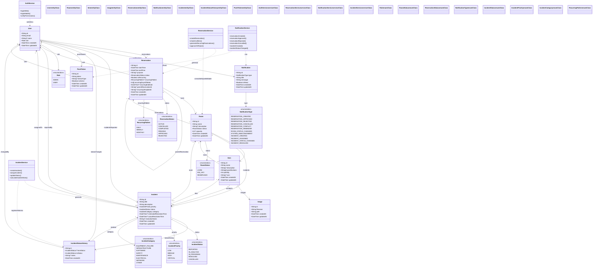

# Diagrama de Classes - Sistema SALA Web

```mermaid
classDiagram
    direction TB

    %% Entidades de Domínio
    class User {
        +String id
        +String email
        +String? name
        +Role role
        +DateTime createdAt
        +DateTime updatedAt
    }

    class Room {
        +String id
        +String name
        +String? description
        +RoomStatus status
        +Int? capacity
        +DateTime createdAt
        +DateTime updatedAt
    }

    class Item {
        +String id
        +String name
        +String? description
        +String[] specifications
        +Int quantity
        +String? icon
        +DateTime createdAt
        +DateTime updatedAt
    }

    class Image {
        +String id
        +String filename
        +String path
        +DateTime createdAt
        +DateTime updatedAt
    }

    class Reservation {
        +String id
        +DateTime startTime
        +DateTime endTime
        +String? purpose
        +ReservationStatus status
        +Boolean isRecurring
        +RecurringPattern? recurringPattern
        +Int[] recurringDaysOfWeek
        +DateTime? recurringEndDate
        +String? parentReservationId
        +String? recurringTemplateId
        +DateTime createdAt
        +DateTime updatedAt
    }

    class Notification {
        +String id
        +NotificationType type
        +String title
        +String message
        +Boolean isRead
        +DateTime createdAt
        +DateTime updatedAt
    }

    class Incident {
        +String id
        +String title
        +String description
        +IncidentPriority priority
        +IncidentStatus status
        +IncidentCategory category
        +DateTime? estimatedResolutionTime
        +DateTime? actualResolutionTime
        +String? resolutionNotes
        +DateTime createdAt
        +DateTime updatedAt
    }

    class IncidentStatusHistory {
        +String id
        +IncidentStatus? fromStatus
        +IncidentStatus toStatus
        +String? notes
        +DateTime createdAt
    }

    class PushToken {
        +String id
        +String token
        +String? deviceType
        +Boolean isActive
        +DateTime createdAt
        +DateTime updatedAt
    }

    %% Serviços de Domínio
    class AuthService {
        +loginWeb()
        +loginMobile()
        +verifyPermissions()
    }

    class ReservationService {
        +createReservation()
        +checkConflicts()
        +generateRecurringReservations()
        +approveOrReject()
    }

    class NotificationService {
        +reservationCreated()
        +reservationApproved()
        +reservationRejected()
        +reservationCancelled()
        +incidentCreated()
        +incidentStatusChanged()
    }

    class IncidentService {
        +createIncident()
        +assignIncident()
        +updateStatus()
        +calculateIncidentStats()
    }

    %% Enums
    class Role {
        <<enumeration>>
        ADMIN
        USER
    }

    class RoomStatus {
        <<enumeration>>
        LIVRE
        EM_USO
        RESERVADO
    }

    class ReservationStatus {
        <<enumeration>>
        ACTIVE
        CANCELLED
        COMPLETED
        PENDING
        APPROVED
        REJECTED
    }

    class NotificationType {
        <<enumeration>>
        RESERVATION_CREATED
        RESERVATION_APPROVED
        RESERVATION_REJECTED
        RESERVATION_CANCELLED
        RESERVATION_CONFLICT
        RESERVATION_REMINDER
        ROOM_STATUS_CHANGED
        SYSTEM_ANNOUNCEMENT
        INCIDENT_CREATED
        INCIDENT_ASSIGNED
        INCIDENT_STATUS_CHANGED
        INCIDENT_RESOLVED
    }

    class IncidentStatus {
        <<enumeration>>
        REPORTED
        IN_ANALYSIS
        IN_PROGRESS
        RESOLVED
        CANCELLED
    }

    class IncidentPriority {
        <<enumeration>>
        LOW
        MEDIUM
        HIGH
        CRITICAL
    }

    class IncidentCategory {
        <<enumeration>>
        EQUIPMENT_FAILURE
        INFRASTRUCTURE
        SOFTWARE
        SAFETY
        MAINTENANCE
        ELECTRICAL
        NETWORK
        OTHER
    }

    class RecurringPattern {
        <<enumeration>>
        DAILY
        WEEKLY
        MONTHLY
    }

    %% Relacionamentos - Entidades
    User "1" --> "*" Reservation : reservations
    User "1" --> "*" Notification : notifications
    User "1" --> "*" Incident : incidentsReported
    User "1" --> "*" IncidentStatusHistory : statusChanges
    User "1" --> "*" PushToken : pushTokens

    Room "1" --> "*" Reservation : reservations
    Room "1" --> "*" Item : items
    Room "1" --> "*" Incident : incidents

    Item "1" --> "*" Image : images
    Item "0..1" --> "1" Room : room
    Item "1" --> "*" Incident : incidents

    Reservation "*" --> "1" User : user
    Reservation "*" --> "1" Room : room
    Reservation "1" --> "0..*" Reservation : childReservations
    Reservation "0..1" --> "1" Reservation : parentReservation

    Incident "*" --> "1" User : reportedBy
    Incident "0..1" --> "1" User : assignedTo
    Incident "0..1" --> "1" Room : room
    Incident "0..1" --> "1" Item : item
    Incident "1" --> "*" IncidentStatusHistory : statusHistory

    IncidentStatusHistory "*" --> "1" Incident : incident
    IncidentStatusHistory "*" --> "1" User : changedBy

    PushToken "*" --> "1" User : user

    %% Relacionamentos - Serviços
    AuthService ..> User : autentica
    ReservationService ..> Reservation : gerencia
    ReservationService ..> Room : consultaDisponibilidade
    NotificationService ..> Notification : cria
    NotificationService ..> PushToken : enviaPush
    IncidentService ..> Incident : gerencia
    IncidentService ..> IncidentStatusHistory : registraHistorico

    %% Relacionamentos - Enums
    User --> Role : role
    Room --> RoomStatus : status
    Reservation --> ReservationStatus : status
    Reservation --> RecurringPattern : recurringPattern
    Notification --> NotificationType : type
    Incident --> IncidentStatus : status
    Incident --> IncidentPriority : priority
    Incident --> IncidentCategory : category

    %% Estilos
    classDef entityClass fill:#e3f2fd,stroke:#1976d2,stroke-width:2px
    classDef serviceClass fill:#f3e5f5,stroke:#7b1fa2,stroke-width:2px
    classDef enumClass fill:#fff3e0,stroke:#f57c00,stroke-width:2px

    class User entityClass
    class Room entityClass
    class Item entityClass
    class Image entityClass
    class Reservation entityClass
    class Notification entityClass
    class Incident entityClass
    class IncidentStatusHistory entityClass
    class PushToken entityClass
    class AuthService serviceClass
    class ReservationService serviceClass
    class NotificationService serviceClass
    class IncidentService serviceClass
    class Role enumClass
    class RoomStatus enumClass
    class ReservationStatus enumClass
    class NotificationType enumClass
    class IncidentStatus enumClass
    class IncidentPriority enumClass
    class IncidentCategory enumClass
    class RecurringPattern enumClass
```

## Descrição das Classes Principais

### Entidades de Domínio

#### User

Usuário do sistema (ADMIN ou USER). Cria reservas, reporta incidentes e recebe notificações.

#### Room

Sala disponível para reserva. Possui status e lista de itens.

#### Item

Equipamento disponível em uma sala.

#### Image

Imagem associada a um item, utilizada para ilustrar equipamentos.

#### Reservation

Reserva de sala, simples ou recorrente. Possui status de aprovação e horários, além de metadados de recorrência (padrão, dias da semana, data de término, vínculo com reserva pai/template).

#### Notification

Notificação do sistema de diferentes tipos.

#### Incident

Incidente reportado com status, prioridade e categoria, que pode estar associado a uma sala ou item.

#### IncidentStatusHistory

Registro de mudanças de status de um incidente, incluindo quem alterou, de qual status para qual e quando.

#### PushToken

Token de push notification associado a um usuário e dispositivo, utilizado para envio de notificações para o app mobile.

### Serviços

#### NotificationService

Gerencia criação e envio de notificações.

#### ReservationService

Gerencia ciclo de vida das reservas.

#### IncidentService

Gerencia ciclo de vida dos incidentes.

#### AuthService

Gerencia autenticação e autorização.

### Enums

- **Role**: ADMIN, USER
- **RoomStatus**: LIVRE, EM_USO, RESERVADO
- **ReservationStatus**: ACTIVE, CANCELLED, COMPLETED, PENDING, APPROVED, REJECTED
- **NotificationType**: Tipos de notificação de reservas, salas, sistema e incidentes
- **IncidentStatus**: REPORTED, IN_ANALYSIS, IN_PROGRESS, RESOLVED, CANCELLED
- **IncidentPriority**: LOW, MEDIUM, HIGH, CRITICAL
- **IncidentCategory**: EQUIPMENT_FAILURE, INFRASTRUCTURE, SOFTWARE, SAFETY, MAINTENANCE, ELECTRICAL, NETWORK, OTHER
- **RecurringPattern**: DAILY, WEEKLY, MONTHLY
