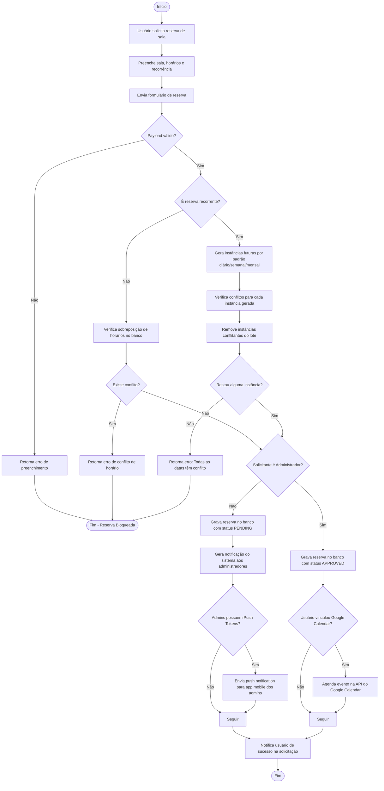
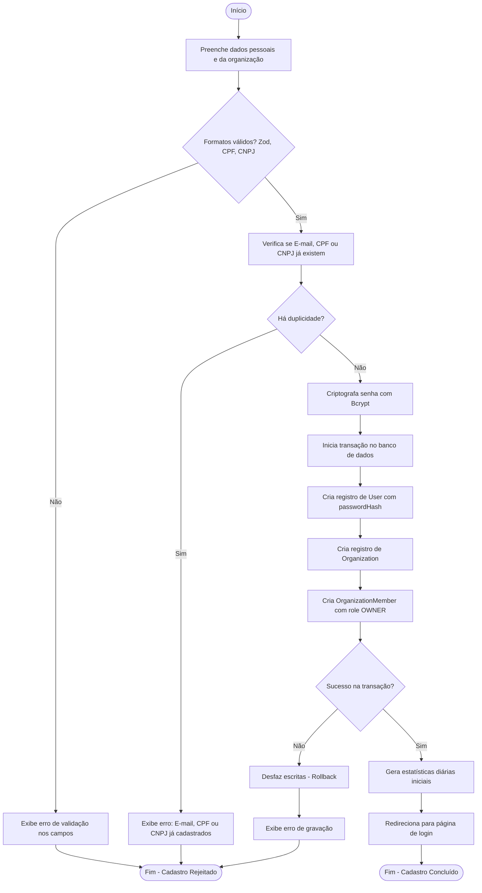
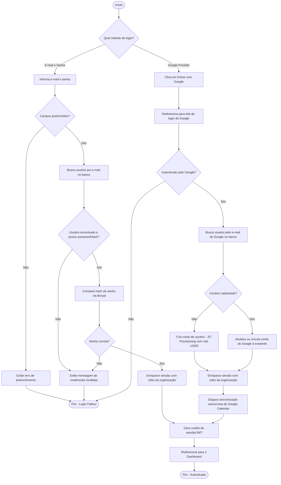

# Diagramas de Atividade (Activity Diagrams) - SALA Web

Este documento reúne os diagramas de atividade que ilustram os fluxos de processos de negócio da aplicação:
1. **Fluxo de Criação de Reserva (Simples ou Recorrente)**
2. **Fluxo de Cadastro de Usuário e Organização (Sign Up)**
3. **Fluxo de Autenticação (Login via Credenciais ou Google)**

---

## 1. Fluxo de Criação de Reserva

Ilustra o comportamento lógico do sistema ao validar conflitos de horário e gravar reservas simples ou recorrentes.

---

## 2. Fluxo de Cadastro (Sign Up)

Ilustra o registro simultâneo do usuário e de sua organização sob uma transação atômica.

---

## 3. Fluxo de Autenticação (Login)

Ilustra o acesso do usuário utilizando Google OAuth ou e-mail/senha local.

