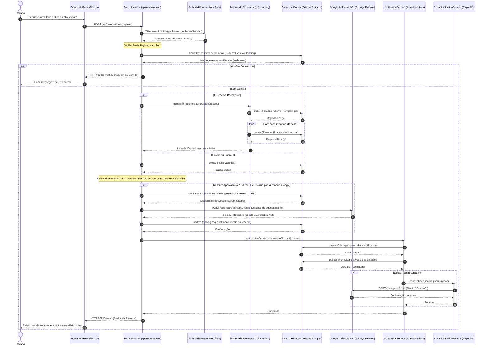
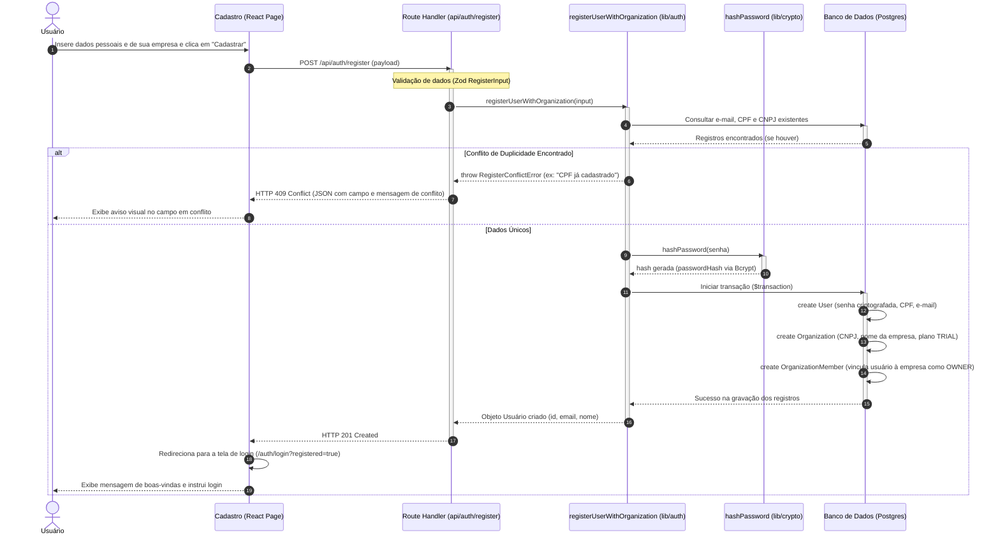
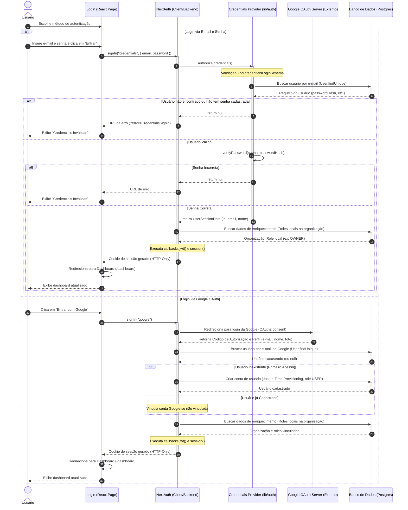

# Diagramas de Sequência (Sequence Diagrams) - SALA Web

Este documento reúne os diagramas de sequência que ilustram as trocas de mensagens e interações temporais entre os componentes da aplicação para os fluxos críticos de:
1. **Criação de Reserva e Sincronização**
2. **Cadastro de Nova Conta e Organização (Sign Up)**
3. **Login Local (E-mail/Senha) e Google OAuth**

---

## 1. Fluxo de Criação de Reserva e Sincronização

Ilustra a criação de uma reserva, a análise de colisão de horários e a posterior sincronização de calendário e disparo de push notifications.

---

## 2. Fluxo de Cadastro de Conta (Sign Up)

Ilustra as chamadas internas para a criação transacional e segura de uma nova conta de usuário proprietário (`OWNER`) e sua respectiva empresa (`Organization`).

---

## 3. Fluxo de Autenticação (Login)

Ilustra o fluxo de mensagens para login com e-mail/senha local e login via conta do Google OAuth.

